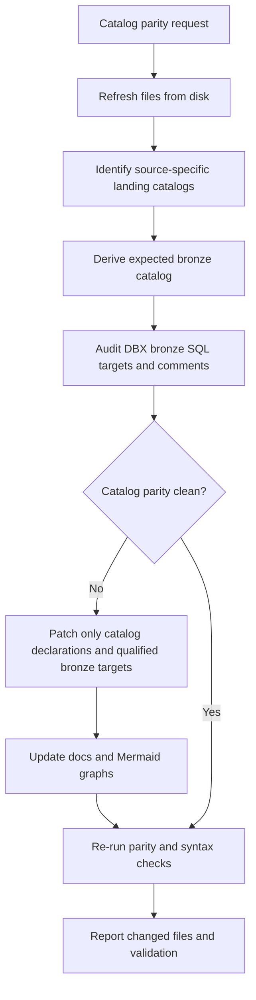

# Catalog Parity Enforcer

## Purpose

Use this skill to keep source-specific Databricks catalogs aligned across landing and bronze layers. The common error this skill prevents is writing a source-specific landing flow, such as `landing_pershing.default`, into the generic `bronze.default` catalog instead of the matching `bronze_pershing.default` catalog.

## Workflow



## Catalog Map

Use this map unless the user gives a newer source-specific rule:

```text
landing.default           -> bronze.default
landing_jh.default        -> bronze_jh.default
landing_pershing.default  -> bronze_pershing.default
landing_sei.default       -> bronze_sei.default
```

Do not treat old source-system catalogs such as `pershing.default`, `jh.default`, or `sei.default` as valid DBX landing or bronze targets.

## Audit Rules

1. Refresh the current files with `rg --files sqlserver_brz sqlserver_brz_dbt sqlserver_lnd_dbt sqlserver_lnd_desc dbx_lnd dbx_brz` before auditing.
2. Inspect `dbx_brz/*.dbx.sql` for `FROM <landing_catalog>.default.<table>` references.
3. Derive the expected bronze catalog from the landing catalog map.
4. Verify these statements use the expected bronze catalog:
   - `CREATE CATALOG IF NOT EXISTS <bronze_catalog>;`
   - `USE CATALOG <bronze_catalog>;`
   - `CREATE OR REPLACE TABLE <bronze_catalog>.default.<table> AS`
   - `COMMENT ON TABLE <bronze_catalog>.default.<table> IS`
5. Verify docs and Mermaid graphs do not describe a stale generic target for a source-specific flow.

## Repair Rules

- Patch only catalog declarations and fully qualified bronze targets unless the user asks for broader regeneration.
- Keep landing references unchanged.
- Keep table names, column names, and comments unchanged unless the catalog name inside a qualified object reference must change.
- Do not introduce apostrophes inside SQL table comment descriptions.
- Do not modify unrelated source families when the request names one family.

## Validation

For a source-specific family, validate with checks equivalent to:

```bash
rg -n 'CREATE CATALOG IF NOT EXISTS bronze;|USE CATALOG bronze;|bronze\.default\.' dbx_brz/brz-pers*.dbx.sql
rg -n 'bronze_pershing\.default|landing_pershing\.default' dbx_brz/brz-pers*.dbx.sql
rg -n $'\t' dbx_brz/brz-pers*.dbx.sql
```

The first command should return no matches for Pershing-specific bronze files. The second command should confirm both source and target catalog families are present.
