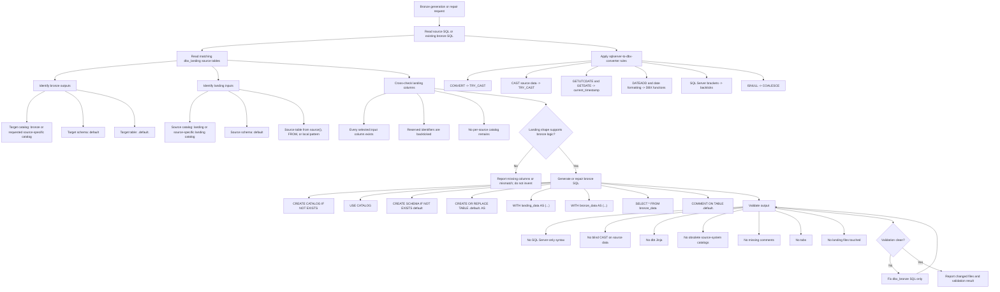

# DBX Bronze Generator

## Purpose

Use this skill to generate or repair `dbx_bronze/*.dbx.sql` files. Bronze SQL should preserve source model logic from `sqlserver_brz/*.ms.sql`, read from the landing layer, write to the bronze layer, and run in Databricks SQL.

This skill owns bronze-file structure, source-to-landing references, output bronze table naming, bronze comments, landing column validation, and bronze-only validation. Use `$sqlserver-to-dbx-converter` for SQL Server type, function, cast, and reserved-word conversion rules.

## Required Preflight

1. Read the source bronze artifact before generating anything.
2. Read the matching `dbx_landing/*.dbx.sql` file to confirm source table and column availability.
3. Read any existing target `dbx_bronze/*.dbx.sql` file and preserve user edits unless replacement is explicitly requested.
4. Confirm the task is bronze-only. Do not create or modify landing files.
5. Check current repo conventions for table naming, comments, and source references before writing.

When the user says to refresh files in memory, do not rely on prior conversation context. Re-list the current files on disk with `rg --files sqlserver_brz sqlserver_dbt dbx_landing dbx_bronze`, then re-read the relevant SQL Server bronze source files, dbt SQL Server files when in scope, the matching landing file or files, and the current target bronze file before comparing or editing.

## Workflow



## Source Input Rules

### `sqlserver_brz/*.ms.sql`

Use SQL Server bronze source files as bronze transformation logic. Extract each model/table block, source references, selected columns, type conversions, date logic, and final output table names from comments or local naming patterns.

### `sqlserver_dbt/*.dbt.ms.sql`

Extract:

- Model name from `-- NAME: ...`.
- Source table from `{{ source("source_name", "TABLE_NAME") }}`.
- Landing columns and transformations from `landing_data`.
- Final bronze output columns from `bronze_data`.

Remove dbt config, Jinja conditionals, `{{ this }}`, and logging blocks from final `.dbx.sql`.

### Existing `dbx_bronze/*.dbx.sql`

When repairing existing bronze SQL, preserve working structure and narrow the edit to the requested behavior. Do not rewrite entire files unless the user asks or the file is structurally unusable.

## Landing Cross-Check Rules

Before writing bronze SQL:

1. Locate the matching `dbx_landing` source table.
2. Extract its `CREATE TABLE` columns.
3. Confirm every landing input referenced by bronze logic exists.
4. Confirm reserved identifiers are referenced consistently with backticks.
5. Report missing columns instead of inventing them.

If the landing file uses a source-specific catalog, preserve that source reference. Otherwise use `landing.default.<table>`.

## Bronze Naming Rules

Use these defaults unless current repo style or source comments provide a stronger answer:

```text
catalog                  -> bronze
schema                   -> default
output table             -> bronze.default.<bronze_model_name>
source table             -> landing.default.<landing_table>
output file              -> dbx_bronze/bronze-<source-family>.dbx.sql
```

When the user requests a source-specific bronze catalog, preserve that catalog in all CTAS and comment targets. Current local exception:

```text
Jack Henry combined bronze -> bronze_jh.default.<bronze_table>
```

For the combined Jack Henry bronze file, use `dbx_landing/landing-jh.dbx.sql` as the landing source of truth and keep source reads on `landing_jh.default.<table>`. The older split `dbx_landing/landing-jh_*.dbx.sql` files may exist for reference, but the combined landing file is the parity input when generating `dbx_bronze/bronze-jh.dbx.sql`.

Use this landing source catalog map:

```text
general landing sources   -> landing.default.<landing_table>
Jack Henry JH_* sources   -> landing_jh.default.<landing_table>
Pershing sources          -> landing_pershing.default.<landing_table>
SEI sources               -> landing_sei.default.<landing_table>
```

Examples:

```text
-- NAME: BRONZE_PERSHING_ACA2_REC_A
-> bronze.default.bronze_pershing_aca2_rec_a

sqlserver_brz/brz-jh_*.ms.sql with requested Jack Henry bronze catalog
-> bronze_jh.default.bronze_jh_<table>

{{ source("pershing", "PERSHING_ACA2_A") }}
-> landing_pershing.default.pershing_aca2_a
```

Do not recreate old source-system catalogs like `apex.default`, `q2.default`, `ibkr.default`, or `pershing.default`. Use the current landing catalog family instead.

## Bronze File Structure

Use this order for each bronze table:

```sql
CREATE CATALOG IF NOT EXISTS <bronze_catalog>;
USE CATALOG <bronze_catalog>;

CREATE SCHEMA IF NOT EXISTS default;
USE SCHEMA default;

-- From <source-file, such as sqlserver_brz/brz-jh_acsret.ms.sql>
-- Source model: <bronze_table>
CREATE OR REPLACE TABLE <bronze_catalog>.default.<bronze_table> AS
WITH landing_data AS (
    SELECT
        <landing columns and source-safe conversions>
    FROM <landing_catalog>.default.<landing_table>
),

bronze_data AS (
    SELECT
        <final bronze columns>
    FROM landing_data
)

SELECT * FROM bronze_data;
COMMENT ON TABLE <bronze_catalog>.default.<bronze_table> IS
'Bronze table <bronze_table> contains standardized data loaded from the landing layer for Databricks validation and downstream processing.';
```

Use meaningful comments when the source context is clear. Generic bronze comments are acceptable only when no useful business context is available.

Do not put apostrophes or single quotes inside `COMMENT ON TABLE ... IS '<description>';` text. Phrases such as `system's` break the SQL string unless escaped, so prefer wording like `system source`, `source system`, or `system-level`. Keep comment text plain ASCII unless the source file already requires otherwise.

## Conversion Rules

Follow `$sqlserver-to-dbx-converter` rules, with these bronze-specific constraints:

- Use `TRY_CAST` for source-data conversions.
- Avoid blind `CAST` on landing columns.
- Replace `GETUTCDATE()` and `GETDATE()` with `current_timestamp()`.
- Replace `CONVERT(INT, CONVERT(nvarchar(6), date_expr, 112))` with `TRY_CAST(date_format(date_expr, 'yyyyMM') AS INT)`.
- Replace `DATEADD("m", -1, date_expr)` with `add_months(date_expr, -1)`.
- Replace `ISNULL` with `COALESCE`.
- Convert SQL Server brackets to Databricks backticks.
- Remove dbt/Jinja in final `.dbx.sql`.

## JSON Rule

Do not use JSON extraction when matching flattened landing columns already exist. Prefer direct selects from the landing table. If the source only exists as JSON and flattened columns are unavailable, report that constraint before introducing JSON parsing.

## Comment Rules

Every `CREATE OR REPLACE TABLE <bronze_catalog>.default.* AS` must have a matching `COMMENT ON TABLE <bronze_catalog>.default.*`. For the normal shared bronze catalog this is `bronze.default.*`; for the requested Jack Henry split catalog this is `bronze_jh.default.*`.

Use a domain-aware description when possible:

- Accounts: account master, registration, lifecycle, balances, ownership.
- Transfers: ACATS/transfer activity, status, contra broker, request, reject details.
- Transactions: movement, amount, posting, source, reference, reconciliation.
- Positions/assets: holdings, market value, quantity, security identifiers.

Fix obvious English typos in generated descriptions when you see them. Do not "fix" source-of-truth object names, table names, column names, or model names merely because they look misspelled; preserve names from SQL Server headers, source references, and existing DBX files unless the user explicitly asks for a rename.

## Validation Checklist

Before finishing:

- Only `dbx_bronze/*.dbx.sql` files were created or edited.
- No `dbx_landing/` files were touched.
- Outputs use `bronze.default` unless the user requested a source-specific bronze catalog, such as `bronze_jh.default` for the combined Jack Henry bronze file.
- Inputs use the matching landing catalog: `landing.default`, `landing_jh.default`, `landing_pershing.default`, or `landing_sei.default`.
- For `dbx_bronze/bronze-jh.dbx.sql`, landing coverage was checked against the current `dbx_landing/landing-jh.dbx.sql`.
- No executable `CONVERT(`, `GETUTCDATE()`, `GETDATE()`, SQL Server brackets, or dbt Jinja remain.
- No blind `CAST(` remains on source data.
- All referenced landing columns exist.
- Reserved identifiers are backticked.
- Every created bronze table has a `COMMENT ON TABLE`.
- Table comments contain no apostrophes or unescaped single quotes inside the description literal.
- No tab characters are introduced.

## Test Prompts

### Dry Assessment Test

Use this prompt to test skill behavior without edits:

```text
Use $dbx-bronze-generator to assess, but do not edit files.

Source bronze SQL:
sqlserver_dbt/landing-pershing_aca2_a.dbt.ms.sql

Landing source:
dbx_landing/landing-pershing_aca2_a.dbx.sql

Tell me the target bronze table, source landing table, required column coverage, and validation checks.
```

Expected behavior:

- It does not edit files.
- It reads the dbt SQL and landing file.
- It identifies `landing_pershing.default.pershing_aca2_a` as the landing source unless current source proves otherwise.
- It identifies `bronze.default.bronze_pershing_aca2_rec_a` from the dbt model name/comment.
- It reports required columns and any missing landing columns.
- It explicitly says no landing edits are needed.

### Generation Test

Use this prompt when writes are intended:

```text
Use $dbx-bronze-generator to generate or repair bronze SQL for:

Source:
sqlserver_dbt/landing-pershing_aca2_a.dbt.ms.sql

Landing:
dbx_landing/landing-pershing_aca2_a.dbx.sql

Write only under dbx_bronze. Do not touch dbx_landing.
```

Expected generated output:

- A repo-consistent `dbx_bronze/bronze-*.dbx.sql` file.
- `CREATE CATALOG IF NOT EXISTS bronze`.
- `CREATE OR REPLACE TABLE bronze.default.<table> AS`.
- Reads from `landing_pershing.default.pershing_aca2_a`.
- Uses `TRY_CAST` for source-data conversion.
- Removes dbt Jinja.
- Adds `COMMENT ON TABLE`.
- Does not edit landing files.

### Manual Validation Commands

Run targeted checks against the generated file:

```bash
rg -n 'CONVERT\(|GETUTCDATE\(|GETDATE\(|\{\{|\{%|\[|\]' dbx_bronze/<generated-file>.dbx.sql
rg -n '\bCAST\(' dbx_bronze/<generated-file>.dbx.sql
rg -n '\b(apex|q2|ibkr|pershing|assist|cos|dmi|fis|manual|mis|mulesoft|rprt|sblc)\.default\b' dbx_bronze/<generated-file>.dbx.sql
rg -n $'\t' dbx_bronze/<generated-file>.dbx.sql
rg -n 'CREATE OR REPLACE TABLE|COMMENT ON TABLE' dbx_bronze/<generated-file>.dbx.sql
```

The first, third, and fourth commands should return no matches. The `CAST` command should return no source-data casts; controlled constant casts may be acceptable only when they match local style and cannot fail.

## Reporting

Report:

- Files created or modified.
- Source SQL and landing files used.
- Bronze table names generated.
- Landing tables read.
- Validation checks performed.
- Any missing landing columns or source-shape mismatches.
