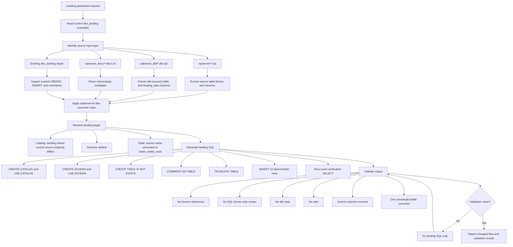

# DBX Landing Generator

## Purpose

Use this skill to create or repair `dbx_landing/*.dbx.sql` files. The output should be deployable Databricks SQL for landing-layer tables and should follow the current repository style.

This skill owns landing-file structure, target landing table naming, generated seed data, table descriptions, and landing validation. Use `$sqlserver-to-dbx-converter` for SQL Server type, function, cast, and reserved-word conversion rules.

## Required Preflight

1. Read the source artifact before generating anything.
2. Read at least one current working `dbx_landing/*.dbx.sql` example from the same source family when available.
3. Check whether the target file already exists and whether it is empty, generated, or user-edited.
4. Preserve user edits unless the user explicitly asks to replace them.
5. Do not edit `dbx_bronze/` or any bronze SQL file.

## Workflow



## Source Input Types

### `sqlserver_desc/*-desc.txt`

Parse each non-empty line as:

```text
COLUMN_NAME sql_server_type
```

Map types using `$sqlserver-to-dbx-converter`. Add standard landing control columns only when the source metadata or local convention requires them. In this repository, generated landing test tables commonly include `YEARMONTH INT` and `LOADED_AT TIMESTAMP`; do not duplicate either if already present.

### `sqlserver_dbt/*.dbt.sql`

Extract:

- Source table from `{{ source("source_name", "TABLE_NAME") }}`.
- Landing columns from the `landing_data` CTE.
- Types from explicit `CONVERT(...)` expressions when present.
- Pass-through columns that appear in `landing_data`.

Remove dbt config, Jinja conditionals, `{{ this }}`, and logging blocks from final `.dbx.sql`.

### `sqlserver/*.sql`

Parse source table blocks and SELECT/CTE logic conservatively. Prefer structured source columns from metadata or explicit SELECT lists over broad regex assumptions. Use existing landing files from the same source family as the naming/style guide.

## Naming Rules

Use these defaults unless the current source-of-truth file shows an intentional exception:

```text
catalog                  -> landing
schema                   -> default
SQL Server source table   -> lower_snake_case Databricks table
output file              -> dbx_landing/landing-<source-family-or-table>.dbx.sql
```

Examples:

```text
"DQP_LANDING"."dbo"."PERSHINGDATAPROD_TRANSFER"
-> landing.default.pershingdataprod_transfer
-> dbx_landing/landing-pershingdataprod_transfer.dbx.sql

{{ source("pershing", "PERSHING_ACA2_A") }}
-> landing.default.pershing_aca2_a
-> dbx_landing/landing-pershing_aca2_a.dbx.sql
```

Do not change special catalog exceptions unless the user asks. For example, if a current landing file intentionally uses a different catalog, preserve it during repairs.

## File Structure

Use this order:

```sql
-- Databricks SQL for source: <source>
-- Generated from <input-path>

CREATE CATALOG IF NOT EXISTS landing;
USE CATALOG landing;

CREATE SCHEMA IF NOT EXISTS default;
USE SCHEMA default;

-- Source: "DQP_LANDING"."dbo"."<SOURCE_TABLE>"
CREATE TABLE IF NOT EXISTS landing.default.<table_name> (
    `COLUMN_NAME` STRING,
    `YEARMONTH` INT,
    `LOADED_AT` TIMESTAMP
);
COMMENT ON TABLE landing.default.<table_name> IS
'Meaningful description of the table, its key entities, and analytical use.';

TRUNCATE TABLE landing.default.<table_name>;

INSERT INTO landing.default.<table_name> (
    `COLUMN_NAME`, `YEARMONTH`, `LOADED_AT`
)
SELECT
    concat('COLUMN_NAME_', format_string('%02d', idx)) AS `COLUMN_NAME`,
    202601 AS `YEARMONTH`,
    timestampadd(DAY, idx - 1, TIMESTAMP '2026-01-01 12:00:00') AS `LOADED_AT`
FROM VALUES (1), (2), (3), (4), (5), (6), (7), (8), (9), (10) AS seed(idx);

-- Row-count verification
SELECT '<table_name>' AS table_name, COUNT(*) AS record_count
FROM landing.default.<table_name>;
```

## Seed Data Rules

Generate exactly 10 deterministic rows unless the user requests another count.

Use these seed patterns:

```text
STRING                  -> concat('<COLUMN>_', format_string('%02d', idx))
INT/BIGINT/SMALLINT     -> idx
DECIMAL(p,s)            -> TRY_CAST(idx * 100.25 AS DECIMAL(p,s))
DOUBLE                  -> TRY_CAST(idx * 100.25 AS DOUBLE)
DATE                    -> date_add(DATE '2026-01-01', idx - 1)
TIMESTAMP               -> timestampadd(DAY, idx - 1, TIMESTAMP '2026-01-01 12:00:00')
BOOLEAN                 -> CASE WHEN idx % 2 = 0 THEN true ELSE false END
YEARMONTH               -> 202601
```

Use `TRY_CAST` for numeric seed expressions to stay aligned with repository conversion standards.

## Description Rules

Every generated table must have a meaningful `COMMENT ON TABLE`.

The description should mention:

- The business entity or source process.
- Key column groups, such as accounts, transfers, balances, transactions, positions, identifiers, dates, or statuses.
- Landing-layer use cases, such as validation, reconciliation, downstream reporting, operational monitoring, or compliance review.

Avoid generic comments like "contains standardized data." Use domain-specific terms from the source table and column names.

## Validation Checklist

Before finishing:

- Only `dbx_landing/*.dbx.sql` files were created or edited.
- No `dbx_bronze/` files were touched.
- Output uses the expected landing catalog/schema.
- Each table has exactly one `CREATE TABLE IF NOT EXISTS`, `COMMENT ON TABLE`, `TRUNCATE TABLE`, and `INSERT INTO` block unless the file intentionally contains multiple source tables.
- All source columns are represented in the landing table.
- There are no duplicate generated control columns.
- No executable `CONVERT(`, `GETUTCDATE()`, `GETDATE()`, SQL Server brackets, or dbt Jinja remain.
- Reserved and ambiguous identifiers are backticked.
- No tab characters are introduced.
- Row-count verification is present.

## Reporting

Report:

- Files created or modified.
- Source artifacts used.
- Table names generated.
- Validation checks performed.
- Any intentional exception, mismatch, or source ambiguity.
