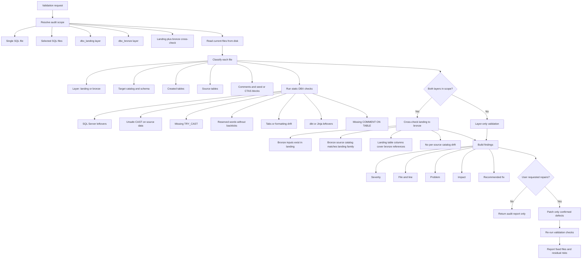

# DBX Validation Auditor

## Purpose

Use this skill to inspect existing Databricks SQL files and produce a precise validation report. The default behavior is read-only: find problems, explain impact, and list safe fixes. Only edit files when the user explicitly asks for repairs.

This skill audits the work produced by `$dbx-landing-generator`, `$dbx-bronze-generator`, and `$sqlserver-to-dbx-converter`.

## Work Units

1. Gather the requested scope: one file, selected files, one layer, or both `dbx_landing` and `dbx_bronze`.
2. Read the current files from disk. Treat the current repo state as the source of truth.
3. Classify each file by layer, source family, target tables, source tables, comments, inserts, and validation queries.
4. Run syntax-pattern checks for SQL Server leftovers and Databricks deployment hazards.
5. Cross-check landing and bronze relationships when both layers are available.
6. Report findings by severity with file references and concrete remediation.
7. If repair is requested, make scoped edits only after the audit identifies the exact defects.

## Workflow



## Audit Plan

Use this plan for every validation pass:

1. Establish scope from the user request.
2. Use `rg --files` to list candidate `*.dbx.sql` files.
3. Read files in parallel when possible.
4. Extract table definitions and references using SQL-aware patterns where practical.
5. Identify layer expectations:
   - Landing files live under `dbx_landing/`.
   - Bronze files live under `dbx_bronze/`.
   - Landing targets use `landing.default` or a source-specific landing catalog.
   - Bronze targets use `bronze.default`.
   - Bronze sources read from the matching landing catalog.
6. Compare actual SQL against those expectations.
7. Report only actionable findings. Do not invent missing source columns or assume exceptions.

## Static Checks

Flag these as deployment or correctness risks:

```text
CONVERT(
GETUTCDATE()
GETDATE()
ISNULL(
{{ or {%
SQL Server [identifier] brackets
blind CAST( on source data
source-family.default catalogs in generated DBX SQL
missing COMMENT ON TABLE
apostrophes or unescaped single quotes inside COMMENT ON TABLE description literals
tab characters
reserved identifiers without backticks
```

Use context before deciding whether `CAST(` is a defect. In this repository, casts over landing/source data should normally be `TRY_CAST`; controlled casts over literals or deterministic seed values may be acceptable if they cannot fail.

## Landing File Rules

For `dbx_landing/*.dbx.sql`, validate:

- The file creates or uses the expected landing catalog.
- Tables are created in the matching landing schema, such as `landing.default`, `landing_jh.default`, `landing_pershing.default`, or `landing_sei.default`.
- Each generated table has a meaningful `COMMENT ON TABLE`.
- Seed files insert exactly 10 deterministic rows unless the file clearly follows a different current convention.
- Row-count verification exists for generated test data.
- No bronze tables or `bronze.default` references appear.
- No dbt/Jinja syntax remains.
- Reserved or ambiguous identifiers are backticked.

## Bronze File Rules

For `dbx_bronze/*.dbx.sql`, validate:

- The file creates or uses the `bronze` catalog.
- Bronze outputs are `bronze.default.<table>`.
- Landing inputs use the matching landing catalog, such as `landing.default.<table>`, `landing_jh.default.<table>`, `landing_pershing.default.<table>`, or `landing_sei.default.<table>`.
- Source-data conversions use `TRY_CAST`.
- SQL Server functions are rewritten to Databricks SQL equivalents.
- JSON extraction is not used when flattened landing columns are available.
- Every bronze table has a matching `COMMENT ON TABLE`.
- `COMMENT ON TABLE` description literals do not contain apostrophes or unescaped single quotes.
- No landing files are modified during bronze repairs.

## Cross-Layer Checks

When both layers are in scope:

1. Map each bronze `FROM <landing_catalog>.default.<table>` reference to a `dbx_landing` table.
2. Extract landing `CREATE TABLE` columns.
3. Extract bronze references to landing columns.
4. Report missing columns with exact bronze file references.
5. Report orphan landing tables only when the user asks for coverage analysis.
6. Preserve source-specific landing catalogs from current source-of-truth files.

Use this expected catalog map:

```text
general landing sources   -> landing.default
Jack Henry JH_* sources   -> landing_jh.default
Pershing sources          -> landing_pershing.default
SEI sources               -> landing_sei.default
bronze outputs            -> bronze.default unless current SEI bronze files intentionally use bronze_sei.default
```

## Finding Severity

Use these severity levels:

- `P0`: SQL will not deploy or targets the wrong catalog/table in a way that can corrupt the layer contract.
- `P1`: SQL may deploy but produces wrong or incomplete data.
- `P2`: SQL is risky, inconsistent, or likely to fail on realistic data.
- `P3`: Style, maintainability, or cleanup issue with low runtime risk.

Findings should include file and line references whenever possible.

## Repair Rules

Only repair files when explicitly asked. When repairing:

- Patch the smallest necessary area.
- Preserve user edits and local formatting.
- Do not regenerate full files unless structurally necessary.
- Do not touch landing while repairing bronze unless the user asks.
- Do not touch bronze while repairing landing unless the user asks.
- Fix obvious English typos in generated comments when encountered, but do not rename source-of-truth tables, columns, models, or source references just because they look misspelled.
- Re-run the relevant static checks after editing.

## Test Prompts

### Single-File Audit Test

```text
Use $dbx-validation-auditor to audit dbx_bronze/bronze-apex.dbx.sql.
Do not edit files.
Report deployment blockers, unsafe casts, missing comments, and source table issues.
```

Expected behavior:

- Reads only the requested file and supporting examples if needed.
- Reports findings with severity and file references.
- Does not edit files.
- Calls out `CAST(` only when it is unsafe in context.

### Cross-Layer Audit Test

```text
Use $dbx-validation-auditor to compare:
dbx_landing/landing-apex.dbx.sql
dbx_bronze/bronze-apex.dbx.sql

Do not edit files. Tell me whether bronze references match landing tables and columns.
```

Expected behavior:

- Reads both files.
- Identifies landing target tables and bronze source references.
- Reports missing landing tables or columns.
- Confirms the matching landing catalog to bronze flow when valid.
- Does not propose JSON parsing when flattened landing columns exist.

### Full Folder Audit Test

```text
Use $dbx-validation-auditor to audit all *.dbx.sql files under dbx_landing and dbx_bronze.
Do not edit files.
Group findings by P0/P1/P2/P3 and include a short remediation plan.
```

Expected behavior:

- Lists all `*.dbx.sql` files under both folders.
- Reads files in batches or parallel chunks.
- Groups findings by severity.
- Separates landing-only, bronze-only, and cross-layer issues.
- Reports residual uncertainty instead of guessing.

### Repair Test

```text
Use $dbx-validation-auditor to audit and repair only unsafe CAST usage in dbx_bronze/bronze-assist.dbx.sql.
Do not change landing files.
```

Expected behavior:

- Audits first.
- Edits only `dbx_bronze/bronze-assist.dbx.sql`.
- Replaces unsafe source-data `CAST` with `TRY_CAST`.
- Leaves controlled literal casts alone when safe.
- Re-runs checks for remaining unsafe casts.

## Manual Validation Commands

Use these commands as targeted checks during audits:

```bash
rg -n 'CONVERT\(|GETUTCDATE\(|GETDATE\(|ISNULL\(|\{\{|\{%|\[|\]' dbx_landing dbx_bronze
rg -n '\bCAST\(' dbx_bronze
rg -n '\b(apex|q2|ibkr|pershing|assist|cos|dmi|fis|manual|mis|mulesoft|rprt|sblc)\.default\b' dbx_landing dbx_bronze
rg -n $'\t' dbx_landing dbx_bronze
rg -n 'CREATE OR REPLACE TABLE|CREATE TABLE IF NOT EXISTS|COMMENT ON TABLE' dbx_landing dbx_bronze
```

Interpret command output in context; grep-style matches are candidates, not automatic defects.

## Reporting Format

Lead with findings:

```text
P1 dbx_bronze/<file>.dbx.sql:<line>
Problem: ...
Impact: ...
Fix: ...
```

Then include:

- Files audited.
- Checks performed.
- Files changed, if repair was requested.
- Remaining test gaps or unresolved source ambiguities.
