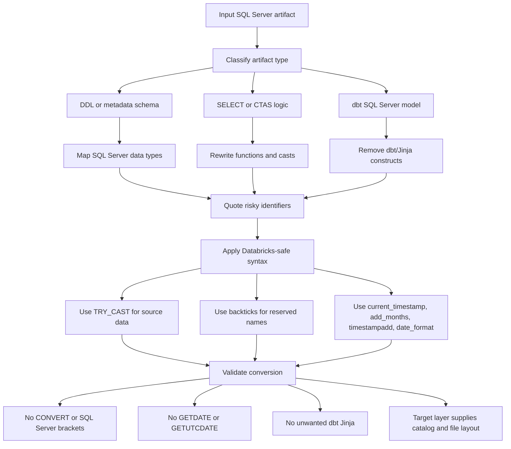

# SQL Server To DBX Converter

## Purpose

Use this skill as the shared conversion reference when translating SQL Server SQL into Databricks SQL. Keep it focused on syntax and semantic equivalence. Do not use this skill by itself to decide landing or bronze catalog names, seed-data strategy, or file layout; those belong to layer-specific generation skills.

## Conversion Workflow

1. Identify whether the input is SQL Server DDL, SQL Server SELECT logic, dbt SQL, or a metadata schema file.
2. Convert SQL Server data types to Databricks SQL data types.
3. Rewrite SQL Server functions and expressions into Databricks equivalents.
4. Quote SQL Server bracketed identifiers and risky/reserved column names with Databricks backticks.
5. Prefer `TRY_CAST` over `CAST` for source-data conversions, especially landing-to-bronze transformations.
6. Remove dbt/Jinja constructs when producing final `.dbx.sql` files.
7. Validate that no SQL Server-only syntax remains.



## Type Mapping

Use these mappings unless the local file or user request provides a more precise target type.

```text
sysname                  -> STRING
varchar, varchar(n)      -> STRING
varchar(max)             -> STRING
nvarchar, nvarchar(n)    -> STRING
char, char(n)            -> STRING
nchar, nchar(n)          -> STRING
int                      -> INT
integer                  -> INT
bigint                   -> BIGINT
tinyint                  -> SMALLINT
smallint                 -> SMALLINT
numeric(p,s)             -> DECIMAL(p,s)
numeric                  -> DECIMAL(38,10) when precision/scale are unknown
decimal(p,s)             -> DECIMAL(p,s)
decimal                  -> DECIMAL(38,10) when precision/scale are unknown
float                    -> DOUBLE
money                    -> DECIMAL(19,4)
bit                      -> BOOLEAN when source values are true flags; otherwise SMALLINT
date                     -> DATE
data                     -> DATE
datetime                 -> TIMESTAMP
datetime2                -> TIMESTAMP
```

Preserve explicit precision and scale when SQL Server provides them. When generating sample landing data and no precision is known, `DECIMAL(38,10)` is the safe repo convention.

## Casting Rules

Prefer `TRY_CAST` for values that originate in source data.

```sql
-- SQL Server
CONVERT(INT, ACCOUNT_ID)
CAST(TOTAL_AMOUNT AS FLOAT)

-- Databricks
TRY_CAST(ACCOUNT_ID AS INT)
TRY_CAST(TOTAL_AMOUNT AS DOUBLE)
```

Use plain `CAST` only for controlled synthetic values or expressions that cannot fail and match existing local style. In this repo, source conversions should use `TRY_CAST`.

## Function Rewrites

```text
CONVERT(type, expr)                         -> TRY_CAST(expr AS dbx_type)
CONVERT(varchar/nvarchar/char/nchar, expr)  -> TRY_CAST(expr AS STRING)
CONVERT(decimal(p,s), expr)                 -> TRY_CAST(expr AS DECIMAL(p,s))
CONVERT(date, expr)                         -> TRY_CAST(expr AS DATE)
CAST(expr AS FLOAT)                         -> TRY_CAST(expr AS DOUBLE)
GETUTCDATE()                                -> current_timestamp()
GETDATE()                                   -> current_timestamp()
DATEADD("m", n, dt)                         -> add_months(dt, n)
DATEADD(month, n, dt)                       -> add_months(dt, n)
DATEADD(day, n, dt)                         -> timestampadd(DAY, n, dt)
DATEDIFF(day, start, end)                   -> datediff(end, start)
ISNULL(expr, fallback)                      -> COALESCE(expr, fallback)
NULLIF(expr, '')                            -> NULLIF(expr, '')
STUFF(expr, start, length, repl)            -> OVERLAY(expr, repl, start, length)
SUBSTRING(expr, start, length)              -> substring(expr, start, length)
LEN(expr)                                   -> length(expr)
LTRIM(expr), RTRIM(expr), TRIM(expr)        -> same names are available
```

For SQL Server `CONVERT(..., style)` date formatting, convert by intent:

```sql
-- SQL Server YEARMONTH
CONVERT(INT, CONVERT(nvarchar(6), LOADED_AT, 112))

-- Databricks
TRY_CAST(date_format(LOADED_AT, 'yyyyMM') AS INT)
```

For SQL Server `DATEADD("m", -1, LOADED_AT)` in YEARMONTH logic:

```sql
TRY_CAST(date_format(add_months(LOADED_AT, -1), 'yyyyMM') AS INT)
```

## Identifier Quoting

SQL Server brackets become Databricks backticks.

```text
[STATE]      -> `STATE`
[TYPE]       -> `TYPE`
[Column A]   -> `Column A`
```

Double quotes around source system names in comments can stay comments. Double quotes around executable identifiers should be converted to backticks unless the file intentionally uses ANSI quoted identifiers.

Preserve original identifier casing when quoting. Do not normalize case unless the generator or local file convention requires it.

## SQL Comment Literal Safety

For generated Databricks `COMMENT ON TABLE ... IS '<description>';` statements, do not put apostrophes or single quotes inside the description text. A phrase like `system's landing data` terminates the SQL string unless escaped. Prefer equivalent wording without an apostrophe, such as `system landing data`, `source system data`, or `system-level data`.

Fix obvious English typos in generated description text. Do not treat source object names, model names, table names, or column names as typos; preserve them exactly unless the user explicitly requests a rename or the source-of-truth file proves the current DBX object name is wrong.

## Reserved And Ambiguous Identifiers

Quote these names with backticks when they appear as column names or aliases:

```text
TYPE
SOURCE
STATE
LANGUAGE
COMMENT
GROUP
KEY
VALUE
NAME
STATUS
CASE
DATE
TIME
TIMESTAMP
ORDER
USER
DESC
DEFAULT
```

Also quote identifiers that contain spaces, punctuation, leading underscores where local style already quotes columns, mixed case from source metadata, or names that collide with Databricks SQL functions.

## dbt SQL Server Model Cleanup

When converting dbt models into final `.dbx.sql` files:

1. Remove `{{ config(...) }}` blocks.
2. Replace `{{ source("source_name", "TABLE_NAME") }}` with the target Databricks table reference chosen by the layer-specific skill.
3. Remove `` and other Jinja control flow unless explicitly producing dbt code.
4. Replace `{{ this }}` with a concrete table name only when the target layer requires equivalent incremental logic.
5. Remove dbt logging blocks.

This skill does not choose the target catalog. The caller must supply that from the task context.

## Examples

### Reserved Identifier And Cast

```sql
-- SQL Server
SELECT
    [TYPE],
    [SOURCE],
    CONVERT(DECIMAL(16,2), AMOUNT) AS AMOUNT
FROM dbo.TRANSFER;

-- Databricks
SELECT
    `TYPE`,
    `SOURCE`,
    TRY_CAST(AMOUNT AS DECIMAL(16,2)) AS AMOUNT
FROM landing.default.transfer;
```

### Date And Timestamp

```sql
-- SQL Server
SELECT
    CONVERT(DATE, DATE_OF_DATA) AS DATE_OF_DATA,
    GETUTCDATE() AS LOADED_AT;

-- Databricks
SELECT
    TRY_CAST(DATE_OF_DATA AS DATE) AS DATE_OF_DATA,
    current_timestamp() AS LOADED_AT;
```

### YEARMONTH

```sql
-- SQL Server
CONVERT(INT, CONVERT(nvarchar(6), DATEADD("m", -1, LOADED_AT), 112)) AS YEARMONTH

-- Databricks
TRY_CAST(date_format(add_months(LOADED_AT, -1), 'yyyyMM') AS INT) AS YEARMONTH
```

## Validation Checklist

Before considering a conversion complete:

- No executable `CONVERT(` remains.
- No executable `GETUTCDATE()` or `GETDATE()` remains.
- No executable SQL Server bracket identifiers remain.
- Generated `COMMENT ON TABLE` descriptions do not contain apostrophes or unescaped single quotes.
- No dbt Jinja remains in `.dbx.sql` output unless explicitly requested.
- Source-data conversions use `TRY_CAST`, not blind `CAST`.
- SQL Server `FLOAT` becomes Databricks `DOUBLE`.
- SQL Server `ISNULL` becomes `COALESCE`.
- Known risky identifiers are backticked.
- Generated SQL follows the target layer's catalog/schema convention.
