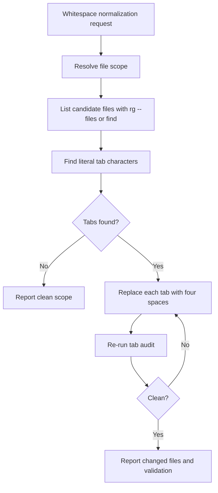

# Whitespace Normalizer

## Purpose

Use this skill to remove literal tab characters from text artifacts and replace each tab with exactly four spaces. Keep the edit mechanical and semantic-neutral: do not rewrite SQL, rename objects, trim trailing spaces, reflow Markdown, or change line endings unless the user explicitly asks.

## Workflow



## Scope Rules

- Treat the current filesystem as the source of truth.
- Default to the files or folders named by the user.
- For broad repository cleanup, include text artifacts such as `*.sql`, `*.md`, `*.txt`, `*.yaml`, `*.yml`, `*.json`, and simple config files.
- Exclude `.git`, binary files, vendored dependencies, generated archives, and lock files unless the user names them directly.
- Prefer `rg --files` to list candidate files when possible.

## Normalization Rules

- Replace every literal tab character with exactly four spaces.
- Preserve all non-tab content, including SQL object names, column names, string literals, and comments.
- Do not trim trailing whitespace unless requested.
- Do not convert spaces back to tabs.
- Do not fix indentation style beyond tab expansion.
- Keep the operation separate from SQL conversion unless both are explicitly part of the same user request.

## Validation

After normalization, re-run a tab audit over the same scope. A clean result means no files in scope contain a literal tab character.

Useful check:

```bash
rg -n $'\t' <scope>
```

## Reporting

Report:

- The normalized scope.
- The files changed.
- The validation command and whether tabs remain.

If tabs remain in files outside the requested scope, mention them separately without editing those files.
