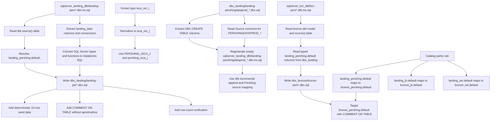
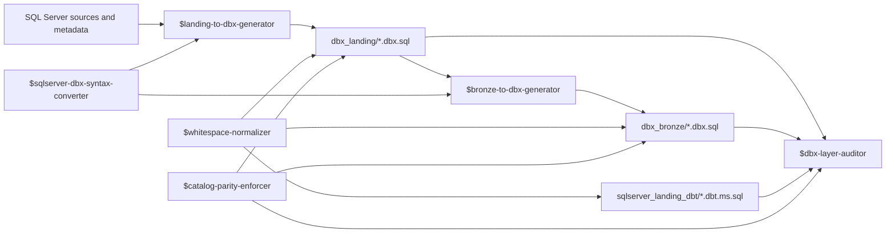

# bbank_dbx
Bradesco Bank Databricks

## SQL Source Layout

- SQL Server bronze source SQL lives under `sqlserver_brz/` as `*.ms.sql`.
- SQL Server landing metadata descriptions live under `sqlserver_landing_desc/`.
- SQL Server landing dbt-derived source models live under `sqlserver_landing_dbt/` as `landing-*.dbt.ms.sql`.
- SQL Server bronze dbt-derived source models live under `sqlserver_brz_dbt/` as `brz-*.dbt.ms.sql`.
- Databricks landing SQL lives under `dbx_landing/` as `*.dbx.sql`.
- Databricks bronze SQL lives under `dbx_bronze/` as `*.dbx.sql`.

For Pershing dbt landing inputs, create matching Databricks landing files from:

```text
sqlserver_landing_dbt/landing-pers*.dbt.ms.sql -> dbx_landing/landing-per*.dbx.sql
```

The target catalog for Pershing landing tables is `landing_pershing.default`, and the table name comes from the dbt `source("pershing", "...")` table name converted to lower snake case.

Known Pershing correction: `isca_rec_i` is a typo. Use `isca_rec_j` for SQL Server, dbt, and DBX landing artifacts sourced from `PERSHING_ISCA_J`.

For Pershing DataProd reverse regeneration, use the current SQL Server landing dbt folder. If an older `dbt_landing/` folder is mentioned but absent, regenerate empty SQL Server dbt models from the matching DBX landing schemas:

```text
dbx_landing/landing-pershingdataprod_*.dbx.sql -> sqlserver_landing_dbt/landing-pershingdataprod_*.dbt.ms.sql
```

The regenerated dbt files read from `{{ source("pershing", "PERSHINGDATAPROD_*") }}`, derive `YEARMONTH` from `LOADED_AT` with SQL Server `CONVERT`, and use the established incremental append pattern.

For Pershing bronze dbt inputs, create matching Databricks bronze files from:

```text
sqlserver_brz_dbt/brz-pers*.dbt.ms.sql -> dbx_bronze/bronze-pers*.dbx.sql
```

The generated bronze files use the dbt model name and `source("pershing", "...")` mapping, read typed columns from the matching `landing_pershing.default` table in `dbx_landing/`, write to `bronze_pershing.default`, and add `COMMENT ON TABLE` descriptions without apostrophes.

Catalog parity rule: source-specific landing catalogs must write to matching source-specific bronze catalogs. Current mappings are `landing_pershing.default -> bronze_pershing.default`, `landing_jh.default -> bronze_jh.default`, and `landing_sei.default -> bronze_sei.default`. Only generic landing sources should write to `bronze.default`.



## Codex Skills

The local skills are named by layer and direction:

- `$landing-to-dbx-generator`: generate or repair Databricks landing SQL from SQL Server landing metadata, SQL Server landing dbt models, or existing DBX landing schemas.
- `$bronze-to-dbx-generator`: generate or repair Databricks bronze SQL from SQL Server bronze SQL, populated dbt transformation models, and DBX landing sources.
- `$dbx-layer-auditor`: audit DBX landing and bronze SQL, including landing-to-bronze coverage and Pershing DataProd DBX-to-landing-dbt pairs.
- `$sqlserver-dbx-syntax-converter`: shared SQL Server to Databricks syntax and type conversion rules.
- `$whitespace-normalizer`: replace tab characters with four spaces and validate that the requested scope is clean.
- `$catalog-parity-enforcer`: audit and repair source-specific landing to bronze catalog symmetry.


