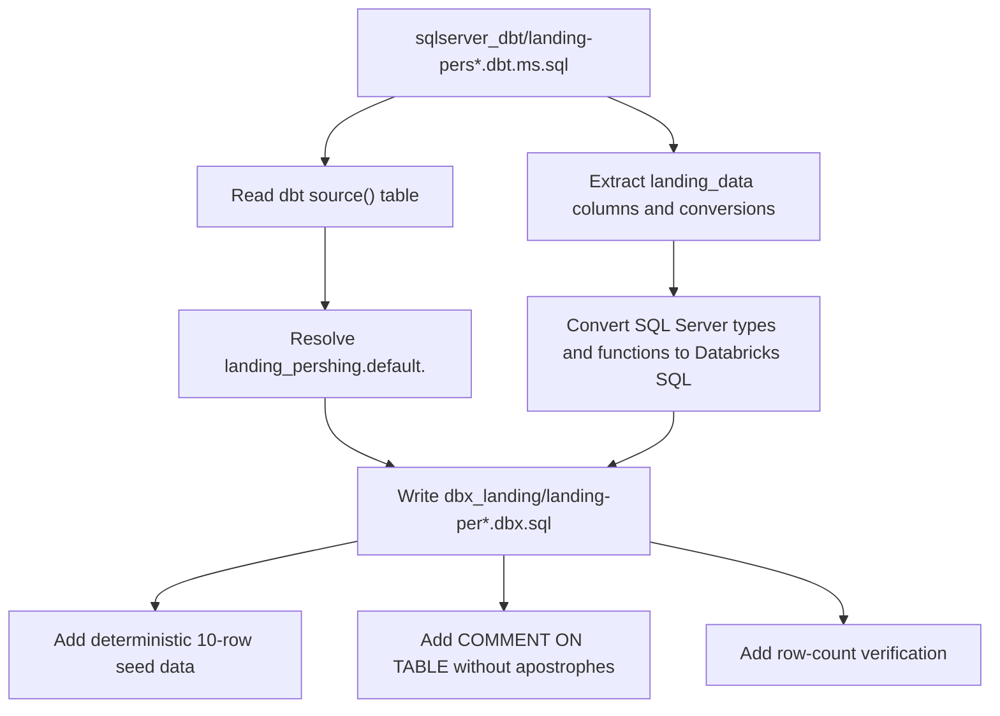

# bbank_dbx
Bradesco Bank Databricks

## SQL Source Layout

- SQL Server bronze source SQL lives under `sqlserver_brz/` as `*.ms.sql`.
- SQL Server dbt-derived source models live under `sqlserver_dbt/` as `*.dbt.ms.sql`.
- Databricks landing SQL lives under `dbx_landing/` as `*.dbx.sql`.
- Databricks bronze SQL lives under `dbx_bronze/` as `*.dbx.sql`.

For Pershing dbt landing inputs, create matching Databricks landing files from:

```text
sqlserver_dbt/landing-pers*.dbt.ms.sql -> dbx_landing/landing-per*.dbx.sql
```

The target catalog for Pershing landing tables is `landing_pershing.default`, and the table name comes from the dbt `source("pershing", "...")` table name converted to lower snake case.


