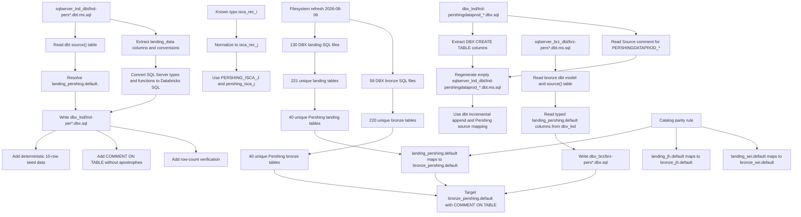
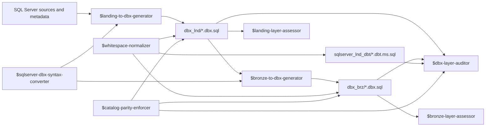

# bbank_dbx
Bradesco Bank Databricks

## SQL Source Layout

- SQL Server bronze source SQL lives under `sqlserver_brz/` as `*.ms.sql`.
- SQL Server landing metadata descriptions live under `sqlserver_lnd_desc/`.
- SQL Server landing dbt-derived source models live under `sqlserver_lnd_dbt/` as `lnd-*.dbt.ms.sql`.
- SQL Server bronze dbt-derived source models live under `sqlserver_brz_dbt/` as `brz-*.dbt.ms.sql`.
- Databricks landing SQL lives under `dbx_lnd/` as `*.dbx.sql`.
- Databricks bronze SQL lives under `dbx_brz/` as `*.dbx.sql`.

## Current Refreshed Inventory

Refreshed from the local filesystem on 2026-08-06:

| Area | Count |
| --- | ---: |
| `sqlserver_brz/*.ms.sql` files | 128 |
| `sqlserver_brz_dbt/brz-pers*.dbt.ms.sql` files | 40 |
| `sqlserver_lnd_dbt/lnd-pers*.dbt.ms.sql` files | 40 |
| `sqlserver_lnd_desc/*pershing*-desc.ms.txt` files | 36 |
| `dbx_lnd/*.dbx.sql` files | 130 |
| `dbx_brz/*.dbx.sql` files | 59 |
| `dbx_brz/brz-pers*.dbx.sql` files | 41 |
| Unique DBX landing tables | 221 |
| Unique DBX bronze tables | 220 |
| Unique Pershing landing tables | 40 |
| Unique Pershing bronze tables | 40 |

The Pershing bronze file count includes the aggregate `dbx_brz/brz-pershing.dbx.sql` plus the 40 one-to-one files generated from `sqlserver_brz_dbt/brz-pers*.dbt.ms.sql`.

`sqlserver_lnd_dbt/` currently has 40 Pershing dbt inputs. `sqlserver_lnd_desc/` has 36 Pershing description files: descriptions are absent for `lnd-pers_accf`, `lnd-pers_pershing`, `lnd-pershing_aca2_rec_a`, and `lnd-pershing_aca2_rec_d`; the DataProd description uses `lnd-pershingdataprod_caps_rec_hist-desc.ms.txt` while the dbt and DBX files use `lnd-pershingdataprod_caps_hist`.

For Pershing dbt landing inputs, create matching Databricks landing files from:

```text
sqlserver_lnd_dbt/lnd-pers*.dbt.ms.sql -> dbx_lnd/lnd-per*.dbx.sql
```

The target catalog for Pershing landing tables is `landing_pershing.default`, and the table name comes from the dbt `source("pershing", "...")` table name converted to lower snake case.

Known Pershing correction: `isca_rec_i` is a typo. Use `isca_rec_j` for SQL Server, dbt, and DBX landing artifacts sourced from `PERSHING_ISCA_J`.

For Pershing DataProd reverse regeneration, use the current SQL Server landing dbt folder. If an older `dbt_landing/` folder is mentioned but absent, regenerate empty SQL Server dbt models from the matching DBX landing schemas:

```text
dbx_lnd/lnd-pershingdataprod_*.dbx.sql -> sqlserver_lnd_dbt/lnd-pershingdataprod_*.dbt.ms.sql
```

The regenerated dbt files read from `{{ source("pershing", "PERSHINGDATAPROD_*") }}`, derive `YEARMONTH` from `LOADED_AT` with SQL Server `CONVERT`, and use the established incremental append pattern.

For Pershing bronze dbt inputs, create matching Databricks bronze files from:

```text
sqlserver_brz_dbt/brz-pers*.dbt.ms.sql -> dbx_brz/brz-pers*.dbx.sql
```

The generated bronze files use the dbt model name and `source("pershing", "...")` mapping, read typed columns from the matching `landing_pershing.default` table in `dbx_lnd/`, write to `bronze_pershing.default`, and add `COMMENT ON TABLE` descriptions without apostrophes.

Catalog parity rule: source-specific landing catalogs must write to matching source-specific bronze catalogs. Current mappings are `landing_pershing.default -> bronze_pershing.default`, `landing_jh.default -> bronze_jh.default`, and `landing_sei.default -> bronze_sei.default`. Only generic landing sources should write to `bronze.default`.



## Codex Skills

The local skills are named by layer and direction:

- `$landing-to-dbx-generator`: generate or repair Databricks landing SQL from SQL Server landing metadata, SQL Server landing dbt models, or existing DBX landing schemas.
- `$bronze-to-dbx-generator`: generate or repair Databricks bronze SQL from SQL Server bronze SQL, populated dbt transformation models, and DBX landing sources.
- `$dbx-layer-auditor`: audit DBX landing and bronze SQL, including landing-to-bronze coverage and Pershing DataProd DBX-to-landing-dbt pairs.
- `$landing-layer-assessor`: assess Databricks landing SQL against the LND landing-layer framework and core prompt.
- `$bronze-layer-assessor`: assess Databricks bronze SQL against the BRZ bronze-layer framework and core prompt.
- `$sqlserver-dbx-syntax-converter`: shared SQL Server to Databricks syntax and type conversion rules.
- `$whitespace-normalizer`: replace tab characters with four spaces and validate that the requested scope is clean.
- `$catalog-parity-enforcer`: audit and repair source-specific landing to bronze catalog symmetry.


