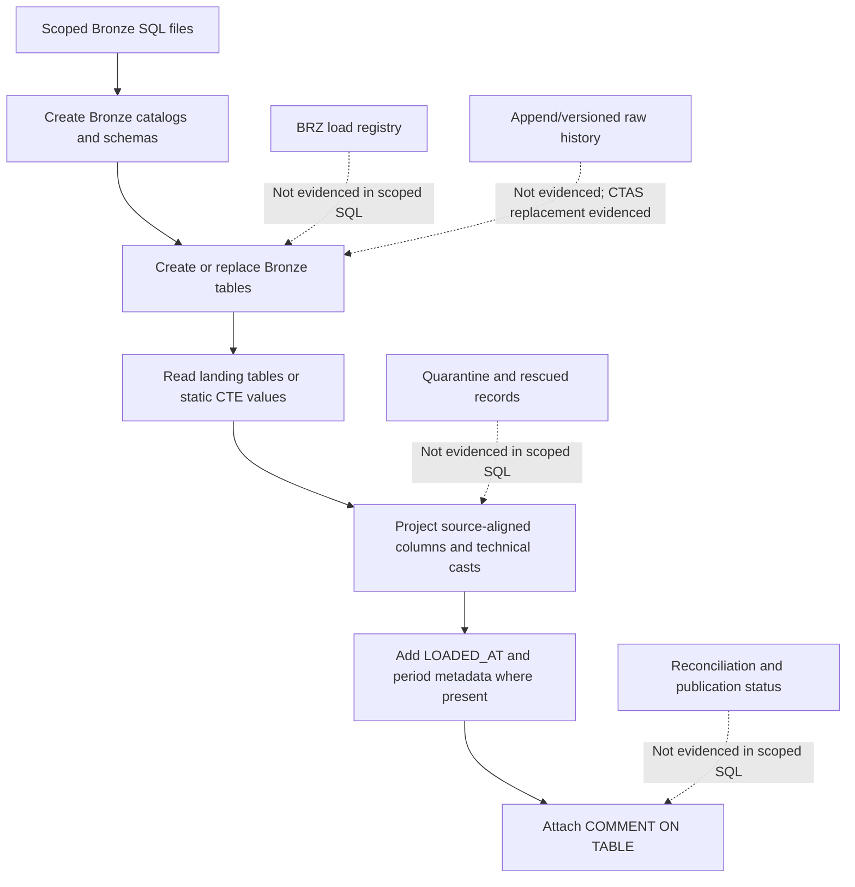
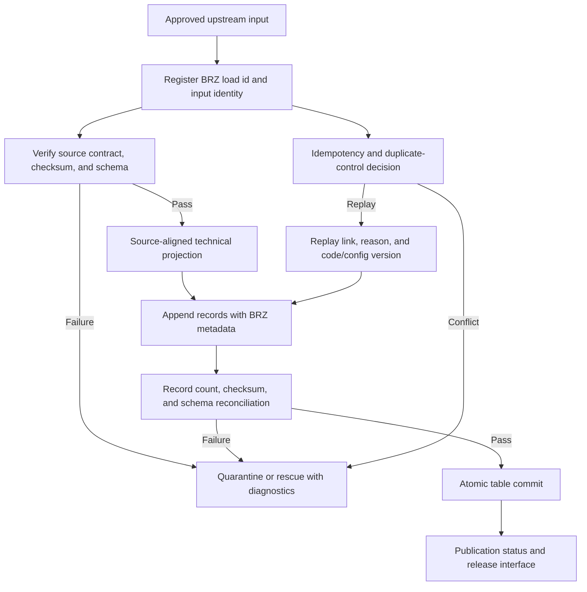

# BRZ Bronze Layer Assessment

**Assessment date:** 2026-08-04  
**Scope:** `dbx_bronze` Bronze SQL files listed below only  
**Rubric:** `BRZ_Bronze_Layer_Standardization_Framework_v1.0_Bronze_Only.md`  
**Core prompt:** `BRZ_Bronze_Layer.md`  
**Assessment posture:** BRONZE-layer only. Table-name conventions, column-name conventions, Landing architecture, Silver, Gold, dimensional modelling, semantic standardization, business validation, enrichment suitability, reporting, and downstream consumption are out of scope.

## Executive Summary

The assessed SQL files provide a consistent Databricks Bronze-schema deployment artifact. Across the scoped SQL, the current evidence shows:

- 221 Bronze tables.
- 221 `COMMENT ON TABLE` statements.
- 435 landing source references.
- 99 tables marked `INCREMENTAL`.
- 6 tables marked `FULL LOAD`.
- 0 SQL Server or dbt/Jinja leftovers detected.
- 0 executable `JOIN`, `MERGE`, `UPDATE`, `DELETE`, `INSERT INTO`, `TRUNCATE`, or `DROP TABLE` statements detected.
- 0 tab characters detected.
- 1 duplicate target table detected: `bronze_jh.default.bronze_jh_lnmant`.
- 3 executable row filters detected.
- 0 table-property, access-control, quarantine/rescue, publication-status, schema-version, checksum/fingerprint, BRZ load id, or pipeline-run controls detected in scoped SQL.

The strongest evidenced controls are queryable Bronze tables, source-to-Bronze projection from landing catalogs, safe type interpretation using Databricks functions, source-specific Bronze catalogs for JH/Pershing/SEI, table documentation coverage, and absence of SQL Server/dbt templating leftovers.

The main confirmed control gaps are destructive `CREATE OR REPLACE TABLE` Bronze load behavior, DMI row filtering, duplicate Jack Henry target DDL, IBKR cross-source lookup behavior, and lack of evidenced load identity, record lineage, idempotency, schema drift, quarantine, publication, retention, security, observability, and recoverability controls. Per `BRZ_Bronze_Layer.md`, missing operational evidence is classified as **Not evidenced**, not automatically as non-compliance.

The assessed Bronze layer is best described as a standardized source-aligned CTAS baseline, not yet an evidenced end-to-end governed BRZ operating model.

## Assessed Files

```text
dbx_bronze/bronze-apex.dbx.sql
dbx_bronze/bronze-assist.dbx.sql
dbx_bronze/bronze-auxiliary.dbx.sql
dbx_bronze/bronze-axiom.dbx.sql
dbx_bronze/bronze-cos.dbx.sql
dbx_bronze/bronze-dmi.dbx.sql
dbx_bronze/bronze-fis.dbx.sql
dbx_bronze/bronze-ibkr.dbx.sql
dbx_bronze/bronze-invoice.dbx.sql
dbx_bronze/bronze-jh.dbx.sql
dbx_bronze/bronze-manual.dbx.sql
dbx_bronze/bronze-mis.dbx.sql
dbx_bronze/bronze-mulesoft.dbx.sql
dbx_bronze/bronze-pershing.dbx.sql
dbx_bronze/bronze-promontory.dbx.sql
dbx_bronze/bronze-q2.dbx.sql
dbx_bronze/bronze-rprt.dbx.sql
dbx_bronze/bronze-sblc.dbx.sql
dbx_bronze/bronze-sei.dbx.sql
```

## Evidence Collection

Evidence was collected using the repository skill helper:

```bash
python3 ../.codex/skills/brz-bronze-layer-assessor/scripts/brz_bronze_sql_evidence.py \
  bronze-apex.dbx.sql bronze-assist.dbx.sql bronze-auxiliary.dbx.sql \
  bronze-axiom.dbx.sql bronze-cos.dbx.sql bronze-dmi.dbx.sql \
  bronze-fis.dbx.sql bronze-ibkr.dbx.sql bronze-invoice.dbx.sql \
  bronze-jh.dbx.sql bronze-manual.dbx.sql bronze-mis.dbx.sql \
  bronze-mulesoft.dbx.sql bronze-pershing.dbx.sql bronze-promontory.dbx.sql \
  bronze-q2.dbx.sql bronze-rprt.dbx.sql bronze-sblc.dbx.sql bronze-sei.dbx.sql
```

Manual spot checks were also used for line-level citations with `rg` and `sed`.

## Current Evidence Flow

The SQL evidence currently shows a Bronze CTAS deployment flow, not the full BRZ operational-control flow.



## Target BRZ Control Flow

The framework target state requires source-aligned raw history with load, record, schema, publication, replay, and recovery evidence.



## Bronze Control Assessment Table

| Framework control | Classification | Evidence | Finding | Risk | Recommended Bronze-only correction | Confidence |
|---|---|---|---|---|---|---|
| BRZ responsibility is documented | Partially compliant | Core prompt and framework exist. Many SQL blocks identify `-- LAYER: BRONZE`, for example `bronze-assist.dbx.sql:16`. | Bronze intent is documented, but implementation boundary is not supported by operational artifacts. | Boundary between deployable CTAS and governed BRZ operating model may be unclear. | Add a BRZ operating contract and per-dataset onboarding specs. | High |
| Source-aligned queryable representation | Compliant | `CREATE OR REPLACE TABLE bronze.default.bronze_apex_daily_accounts AS` at `bronze-apex.dbx.sql:13`; `FROM landing.default.apex_daily_accounts` at `bronze-apex.dbx.sql:79`. | SQL creates queryable Bronze tables from landing sources. | Low structural risk. | Preserve explicit source-to-Bronze mapping in every table spec. | High |
| Source-specific catalog separation | Compliant | JH targets `bronze_jh.default` in `bronze-jh.dbx.sql:12`; SEI targets `bronze_sei.default` in `bronze-sei.dbx.sql:12`; Pershing targets `bronze_pershing.default` in `bronze-pershing.dbx.sql:13`. | General and source-specific Bronze catalogs are visible. | Low catalog-boundary risk in scoped SQL. | Keep the source-specific catalog map documented. | High |
| Table documentation coverage | Compliant | 221 `COMMENT ON TABLE` statements for 221 created tables. Example: `bronze-invoice.dbx.sql:64`. | Every scoped table has a table comment. | Comment wording sometimes refers to downstream parity and analytics. | Rewrite comments to emphasize raw source-aligned Bronze evidence only. | High |
| SQL conversion deployability | Compliant | Evidence helper detected 0 SQL Server/dbt/Jinja leftovers and 0 tab characters. | SQL is free of the common conversion leftovers checked by the helper. | Low deployment-pattern risk from those checks. | Keep static validation in CI. | High |
| Source-contract technical type interpretation | Partially compliant | Safe casts are common, for example `TRY_CAST(FIRSTPB AS DECIMAL(19,3))` in `bronze-dmi.dbx.sql:32`. | Type interpretation generally uses safe Databricks functions. | Invalid values may become null without rescued-record evidence. | Pair `TRY_CAST` with rescued-value or quarantine diagnostics for failed conversions. | Medium |
| Raw history and immutability | Non-compliant in scoped SQL | 221 `CREATE OR REPLACE TABLE` statements, for example `bronze-apex.dbx.sql:13`. | Recurring replacement is destructive unless history is preserved elsewhere. | Published Bronze history can be overwritten or become unreconstructable. | Use append/versioned Bronze history with load ids, or document a governed exception with retained raw history elsewhere. | High |
| Append-oriented processing | Non-compliant in scoped SQL | `CREATE OR REPLACE TABLE ... AS` is used throughout; no `INSERT INTO` append pattern is detected. | SQL evidence shows replacement, not append history. | Replays, corrections, and resends cannot be distinguished in table history. | Replace CTAS refresh with append-by-load or versioned snapshot tables. | High |
| Row preservation | Non-compliant | `WHERE MSP_LAST_RUN_DATE IS NOT NULL` in `bronze-dmi.dbx.sql:262`, `bronze-dmi.dbx.sql:572`, and `bronze-dmi.dbx.sql:761`. | Accepted source rows are excluded in Bronze. | Silent data loss and incomplete raw-history evidence. | Preserve all rows and add technical validity status, or quarantine invalid rows with diagnostics. | High |
| Source isolation / no enrichment | Non-compliant | IBKR derives `AsOfDate` from `landing_jh.default.jh_ddpar1` while reading `landing.default.bcp_ibkr_account` at `bronze-ibkr.dbx.sql:48`. | Bronze mixes an IBKR table with a Jack Henry lookup. | Cross-source enrichment blurs raw source evidence. | Move the lookup downstream or persist only IBKR source-provided fields in Bronze. | High |
| Target uniqueness | Non-compliant | `bronze_jh.default.bronze_jh_lnmant` is created at `bronze-jh.dbx.sql:11373` from `jh_lnhist` and again at `bronze-jh.dbx.sql:11438` from `jh_lnmant`. | Later DDL overwrites the earlier target. | One source projection is lost during deployment. | Split targets or correct the source/target mapping. | High |
| Static/reference data in Bronze | Partially compliant | Static seed blocks exist, for example `bronze-auxiliary.dbx.sql:25`, `bronze-auxiliary.dbx.sql:63`, and `bronze-dmi.dbx.sql:1172`. | Some Bronze objects are manually seeded rather than sourced from an approved upstream extract. | Source lineage for static values is not evidenced. | Document approved source/owner/version for static Bronze inputs or relocate to a governed reference layer. | Medium |
| Load identity metadata | Partially compliant | `LOADED_AT` is widely present, for example `bronze-assist.dbx.sql:54`; helper found 0 BRZ load id and 0 pipeline-run mentions. | Load timestamp exists, but required load identity concepts are missing. | Loads cannot be uniquely traced or replayed. | Add `BRZ_LOAD_ID`, upstream input id, pipeline run id, code/config version, write mode, and commit id. | High |
| Record lineage metadata | Partially compliant | `YEARMONTH` and `LOADED_AT` are common; helper found 22 source-file style mentions and no universal record/input id. | Some record context exists, but end-to-end record lineage is incomplete. | Records cannot be tied to exact input object, row, event, or load. | Add source object/file/message reference, source row/event position, record fingerprint, and schema version. | Medium |
| Schema capture and evolution | Not evidenced | No table properties, schema fingerprint, schema version, drift mode, or drift disposition detected. | Drift governance cannot be assessed from scoped SQL. | Source schema changes may silently alter or lose evidence. | Add source-declared schema, observed schema, published BRZ schema, fingerprints, and drift policy. | Not assessable |
| Idempotency and duplicate control | Not evidenced | No checksum/fingerprint, idempotency key, duplicate outcome, or conflict handling detected. `DUPLICATE_RECORD_INDICATOR` in `bronze-pershing.dbx.sql:1480` appears to be a source field, not a BRZ control. | Duplicate handling cannot be assessed. | Reprocessing and conflicts may have uncontrolled effects. | Define deterministic load id, exact-record identity, duplicate outcomes, and conflict quarantine. | Not assessable |
| CDC, delete, tombstone, and ordering preservation | Not evidenced | Some source delete/status fields exist, but no CDC operation, source sequence, transaction id, tombstone policy, or ordering contract is evidenced. | CDC applicability and preservation cannot be assessed. | Current-state-only or out-of-order behavior may be hidden. | Declare ingestion mode per dataset and preserve CDC envelope fields where supplied. | Not assessable |
| Technical validation and quarantine | Not evidenced | No quarantine/rescue pattern, error taxonomy, rescued record count, or quarantine location detected. | Failed or malformed records have no evidenced disposition. | Invalid records may be dropped, overwritten, or silently nulled. | Add quarantine/rescue tables with original evidence and diagnostics. | Not assessable |
| Reconciliation and publication gate | Not evidenced | No count checks, checksum reconciliation, load status, publication event, or release interface detected in scoped Bronze SQL. | Publication eligibility is not auditable. | Consumers may observe incomplete or unreconciled Bronze loads. | Add load audit table with input/output counts, checksums, commit id, and publication status. | Not assessable |
| Atomicity and recoverability | Not evidenced | CTAS statements are present, but no restart strategy, failure states, recovery tests, or commit/publication metadata is evidenced. | Recovery behavior cannot be assessed. | Failed loads may leave ambiguous table state. | Document restart/replay strategy and test failure scenarios. | Not assessable |
| Security and access model | Not evidenced | Helper detected 0 grants, masks, row filters, tags, or access-control statements. | Raw-data access controls are not evidenced in scoped SQL. | Sensitive Bronze access may be overexposed. | Provide Unity Catalog grants, classification tags, masking/filtering policy, and audit evidence. | Not assessable |
| Retention and destructive maintenance | Not evidenced | No retention/vacuum table properties or lifecycle config found. `RETENTION` hits in COS/SEI appear to be source columns. | Retention governance cannot be assessed. | Historical evidence may expire or be retained without policy. | Define retention for records, snapshots, schema history, load metadata, quarantine, logs, replay, and legal hold. | Not assessable |
| Observability and ownership | Not evidenced | No alerting, SLOs, metric tables, owner tags, or runbook references detected. | Operational ownership and service controls are not evidenced. | Failures, late loads, drift, and quarantine aging may go unmanaged. | Add owner metadata, metrics, alerts, SLOs, and runbooks. | Not assessable |

## Confirmed Strengths

- The assessed files consistently create Bronze tables in expected Bronze catalogs.
- Every created table has a matching `COMMENT ON TABLE`.
- Most transformations are source-column projections from landing tables.
- Databricks-safe `TRY_CAST` patterns are widely used.
- No SQL Server-only functions, dbt/Jinja leftovers, executable joins, executable mutations, or tab characters were detected by the helper.
- JH, SEI, and Pershing use source-specific Bronze catalogs in the scoped SQL.

## Confirmed Control Gaps

### P1 - Bronze history is overwritten by CTAS replacement

**Problem:** The framework requires append-oriented, historically reproducible Bronze evidence.  
**Evidence:** `CREATE OR REPLACE TABLE` appears 221 times, including `bronze-apex.dbx.sql:13`, `bronze-assist.dbx.sql:12`, and `bronze-jh.dbx.sql:12`.  
**Risk:** Reprocessing can replace prior published evidence and weaken replay/reproducibility.  
**Correction:** Implement append/versioned loads keyed by `BRZ_LOAD_ID`, or document an exception with complete retained raw history elsewhere.

### P1 - DMI Bronze filters accepted source rows

**Problem:** Bronze should not silently drop records because a technical field is null.  
**Evidence:** `bronze-dmi.dbx.sql:262`, `bronze-dmi.dbx.sql:572`, and `bronze-dmi.dbx.sql:761` filter `MSP_LAST_RUN_DATE IS NOT NULL`.  
**Risk:** Source evidence is incomplete and unreconciled.  
**Correction:** Preserve all rows and route technically invalid rows to quarantine or mark them with validation status.

### P1 - Duplicate JH target overwrites a source projection

**Problem:** `bronze_jh.default.bronze_jh_lnmant` is created twice.  
**Evidence:** `bronze-jh.dbx.sql:11373` reads `landing_jh.default.jh_lnhist`; `bronze-jh.dbx.sql:11438` reads `landing_jh.default.jh_lnmant`.  
**Risk:** The first table contents are overwritten by the second CTAS.  
**Correction:** Correct the target/source mapping so each source projection has a unique Bronze target.

### P1 - IBKR Bronze contains cross-source lookup evidence

**Problem:** Bronze should preserve source-aligned evidence without cross-source enrichment.  
**Evidence:** `bronze-ibkr.dbx.sql:48` derives `AsOfDate` from `landing_jh.default.jh_ddpar1` while building an IBKR table.  
**Risk:** The table no longer represents only the IBKR source record projection.  
**Correction:** Move the Jack Henry lookup downstream, or ingest an IBKR-provided as-of field if available.

### P2 - Operational BRZ controls are not evidenced

**Problem:** The SQL does not evidence load id, input id, checksums, schema fingerprint, drift handling, quarantine, publication status, replay controls, access controls, retention, or recovery tests.  
**Evidence:** Helper detected 0 matches for BRZ load id, checksum/fingerprint, pipeline run, schema version, table properties, access controls, quarantine/rescue, or publication status.  
**Risk:** The BRZ operating model cannot be audited end to end.  
**Correction:** Add a BRZ control schema or metadata tables and integrate them into pipelines.

## Controls Not Evidenced

The following framework controls are not evidenced in the scoped SQL and Markdown artifacts. Per `BRZ_Bronze_Layer.md`, these are not automatically classified as non-compliant without pipeline, orchestration, catalog, governance, or runtime evidence.

| Control area | Missing evidence needed for assessment |
|---|---|
| Upstream input identity | Delivery/extraction id, original object/file/message reference, source batch or transaction id, source extraction timestamp, upstream acceptance timestamp. |
| BRZ load identity | `BRZ_LOAD_ID`, pipeline name, pipeline run id, code release or commit, configuration version, execution environment, write mode, table commit/version id. |
| Record lineage | Record fingerprint, source row/event position, source partition/file/message reference, input id, load id, source schema version, observed BRZ schema version. |
| Schema evolution | Source-declared schema, observed input schema, published BRZ schema, schema fingerprint, drift classification, evolution mode, approval evidence. |
| Idempotency and duplicate control | Deterministic load key, exact-record identity, duplicate outcome, conflict rule, replay indicator, original load reference. |
| CDC and tombstone preservation | Operation type, source event id, transaction id, sequence/log position, delete/tombstone/truncate indicator, checkpoint range, ordering contract. |
| Quarantine and rescued records | Quarantine table/location, rescued record payload, error category/code/message, failed field/path, owner queue, disposition status, replay linkage. |
| Reconciliation and publication | Input/output counts, rescued/quarantined counts, checksum reconciliation, publication status, release interface, publication exception records. |
| Security and access | Unity Catalog grants, read/write identities, data classification, masking/filtering policy, audit logging, privileged access process. |
| Retention and recovery | Raw-history retention, table-history retention, quarantine retention, vacuum/archival policy, legal hold, restart strategy, recovery tests. |
| Observability and ownership | Owner metadata, metrics, SLOs, alerts, runbooks, incident records, unresolved quarantine age, replay and failure metrics. |

## Operational Risks

- Reprocessing risk: CTAS replacement is repeatable but not evidenced as idempotent or historical.
- Audit risk: without input identity, checksum, and record lineage, the platform cannot prove exact source-to-Bronze traceability.
- Data-loss risk: DMI filters remove records from Bronze instead of preserving or quarantining them.
- Source-fidelity risk: cross-source lookup behavior introduces non-source-aligned enrichment.
- Governance risk: security, ownership, retention, publication, and recovery controls are absent from scoped evidence.

## Required Corrections

1. Fix duplicate target `bronze_jh.default.bronze_jh_lnmant`.
2. Remove DMI row filters from Bronze CTAS logic and replace them with quarantine or technical status handling.
3. Remove cross-source lookup logic from `bronze-ibkr.dbx.sql`.
4. Replace destructive CTAS refresh with append/versioned Bronze history, or document a governed exception with reconstructable retained raw history.
5. Add mandatory BRZ metadata: load id, upstream input id, source object/file/message reference, pipeline run id, code/config version, schema version, write mode, and commit id.
6. Add reconciliation and publication controls with input/output counts, checksums, publication status, and failure disposition.
7. Add schema fingerprint, drift classification, rescued-data, quarantine, idempotency, duplicate, replay, recovery, retention, and access-control evidence.

## Recommended Improvements

1. Maintain a machine-readable BRZ dataset onboarding file per source/table.
2. Add a shared BRZ load audit table and record-level lineage contract.
3. Add CI checks for duplicate targets, executable row filters, CTAS replacement, missing comments, SQL Server/Jinja leftovers, and cross-source references.
4. Normalize table comments so they describe raw source-aligned Bronze evidence rather than downstream analytics.
5. Add table properties or catalog tags for owner, sensitivity, retention class, source system, contract version, and ingestion mode.
6. Add a standard quarantine schema with error taxonomy and replay linkage.

## Prioritized Remediation Backlog

| Priority | Backlog item | Target outcome |
|---|---|---|
| P1 | Correct duplicate `bronze_jh.default.bronze_jh_lnmant` target. | No source projection is overwritten during deployment. |
| P1 | Remove DMI row filters or convert them to quarantine/status handling. | Accepted source rows are preserved. |
| P1 | Remove IBKR cross-source lookup from Bronze. | Bronze remains source-aligned. |
| P1 | Replace CTAS replacement with append/versioned loads. | Raw Bronze history is auditable and reconstructable. |
| P1 | Define BRZ load and record metadata contract. | Every record links to input, load, pipeline, schema, and commit evidence. |
| P2 | Add schema fingerprint and drift disposition. | Schema changes are governed without silent loss. |
| P2 | Add idempotency, duplicate, replay, and conflict controls. | Reruns and repeated inputs are deterministic and auditable. |
| P2 | Add quarantine/rescued-data tables and error taxonomy. | Failed records are preserved with diagnostics. |
| P2 | Add reconciliation and publication status. | Consumers see only complete, validated Bronze loads. |
| P2 | Add security, retention, observability, ownership, and recovery evidence. | BRZ operations are governed and measurable. |
| P3 | Rewrite downstream-oriented table comments. | Documentation reinforces the Bronze boundary. |

## Additional Evidence Required

The following evidence is required to complete an implementation-grade BRZ assessment:

- ingestion SQL, notebooks, jobs, or pipeline definitions;
- upstream delivery or extraction registry;
- source contracts and schema snapshots;
- input checksums, manifests, or content fingerprints;
- BRZ load audit records;
- table history, commit metadata, and publication status records;
- reconciliation results;
- schema drift decisions and approvals;
- quarantine/rescue records and error taxonomy;
- duplicate/idempotency/replay runbooks;
- CDC envelope samples and ordering/checkpoint policy where applicable;
- Unity Catalog grants, tags, masks, row filters, and access audit evidence;
- retention, vacuum, archival, legal-hold, and restore configuration;
- observability metrics, alert routing, SLOs, and incident/recovery test evidence.

## Overall Confidence Assessment

Overall confidence is **Medium**. SQL structure and static evidence are strong and repeatable. Operational BRZ compliance remains largely **Not evidenced** because the scoped artifacts do not include runtime, orchestration, governance, security, retention, or recovery evidence.
