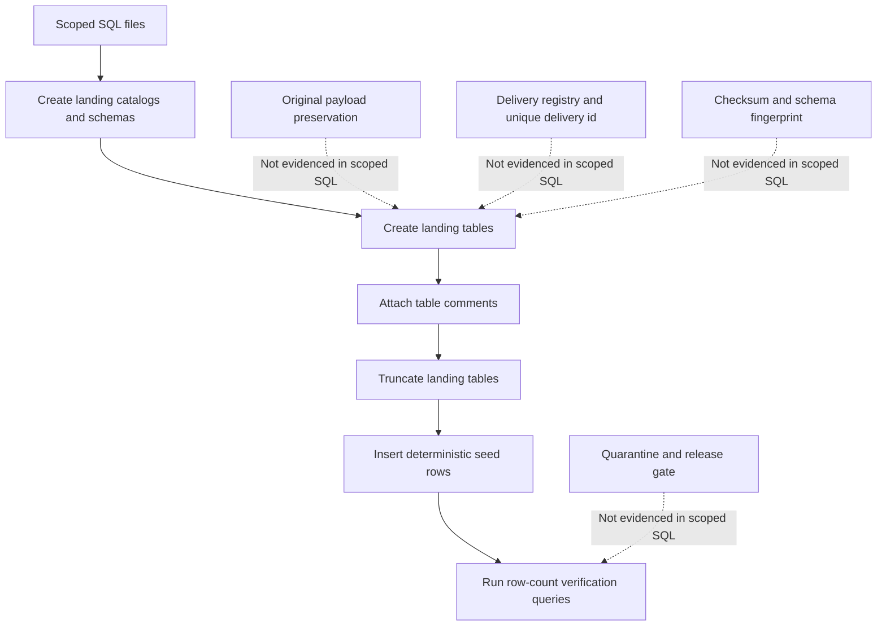
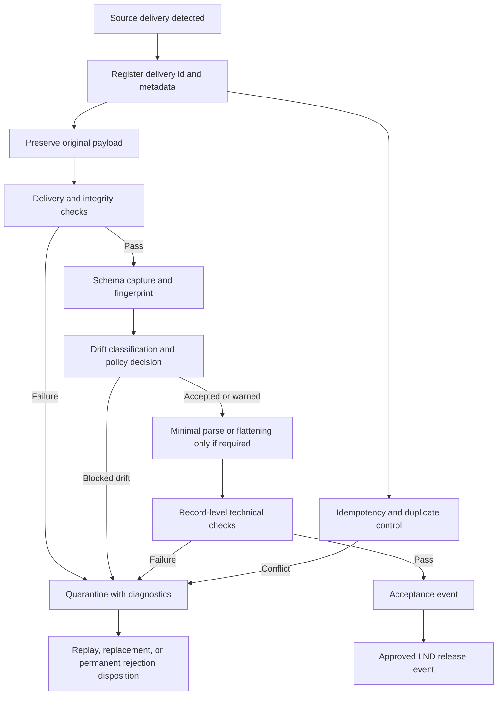

# LND Landing Layer Assessment

**Assessment date:** 2026-08-04  
**Scope:** `dbx_landing` landing SQL files only  
**Rubric:** `LND_Landing_Layer_Standardization_Framework_v1.2_Landing_Only.md`  
**Core prompt:** `LND_Landing_Layer.md`  
**Assessment posture:** LANDING-layer only. Bronze, Silver, Gold, dimensional modelling, business transformations, semantic standardization, and downstream consumption are out of scope.

## Executive Summary

The assessed SQL files provide a consistent Databricks landing-schema deployment artifact. Across the scoped SQL, the current evidence shows:

- 221 landing tables.
- 221 `COMMENT ON TABLE` statements.
- 221 `INSERT INTO` statements.
- 221 `TRUNCATE TABLE` statements.
- 221 row-count verification queries.
- 221 source-comment markers.
- 0 SQL Server or dbt/Jinja leftovers detected.
- 0 `bronze`, `silver`, or `gold` catalog references detected.
- 0 executable `JOIN`, `MERGE`, `UPDATE`, or `DELETE` statements detected.
- 0 tab characters detected.

The strongest evidenced controls are landing-layer separation, Databricks deployability, table documentation coverage, deterministic seed/test data, row-count verification, and absence of downstream-layer references.

The main control gap is that the SQL files alone do not evidence the operational LND contract. The framework defines LND as an ingress and evidence layer that proves delivery arrival, preservation, validation, idempotency, drift handling, quarantine, accepted release, ownership, security, retention, and observability. Those controls require pipeline, storage, metadata, governance, and operations artifacts that are not present in the scoped SQL files. Per `LND_Landing_Layer.md`, this assessment classifies those areas as **Not evidenced**, not as non-compliant.

The assessed landing layer is best described as a standardized schema-and-seed baseline, not yet an evidenced end-to-end LND operating model.

## Assessed Files

```text
dbx_landing/landing-apex.dbx.sql
dbx_landing/landing-assist.dbx.sql
dbx_landing/landing-auxiliary.dbx.sql
dbx_landing/landing-axiom.dbx.sql
dbx_landing/landing-cos.dbx.sql
dbx_landing/landing-dmi.dbx.sql
dbx_landing/landing-fis.dbx.sql
dbx_landing/landing-ibkr.dbx.sql
dbx_landing/landing-invoice.dbx.sql
dbx_landing/landing-jh.dbx.sql
dbx_landing/landing-manual.dbx.sql
dbx_landing/landing-mis.dbx.sql
dbx_landing/landing-mulesoft.dbx.sql
dbx_landing/landing-pershing.dbx.sql
dbx_landing/landing-promontory.dbx.sql
dbx_landing/landing-q2.dbx.sql
dbx_landing/landing-rprt.dbx.sql
dbx_landing/landing-sblc.dbx.sql
dbx_landing/landing-sei.dbx.sql
```

## Evidence Collection

Evidence was collected using the repository skill helper:

```bash
python3 ../.codex/skills/lnd-landing-layer-assessor/scripts/lnd_landing_sql_evidence.py \
  landing-apex.dbx.sql landing-assist.dbx.sql landing-auxiliary.dbx.sql \
  landing-axiom.dbx.sql landing-cos.dbx.sql landing-dmi.dbx.sql \
  landing-fis.dbx.sql landing-ibkr.dbx.sql landing-invoice.dbx.sql \
  landing-jh.dbx.sql landing-manual.dbx.sql landing-mis.dbx.sql \
  landing-mulesoft.dbx.sql landing-pershing.dbx.sql landing-promontory.dbx.sql \
  landing-q2.dbx.sql landing-rprt.dbx.sql landing-sblc.dbx.sql landing-sei.dbx.sql
```

Manual spot checks were also used for line-level citations with `rg` and `sed`.

## Current Evidence Flow

The SQL evidence currently shows a schema/seed deployment flow, not the full LND delivery-control flow.



## Target LND Control Flow

The framework target state requires a controlled delivery lifecycle before any accepted release leaves LND.



## Control-by-Control Assessment

| Framework control | Classification | Evidence | Confidence |
|---|---|---|---|
| LND responsibility is documented | Partially compliant | The framework and core prompt document the LANDING-only responsibility. SQL file headers identify landing sources, for example `landing-apex.dbx.sql:1` and `landing-rprt.dbx.sql:1`. The implementation boundary in pipeline/runtime artifacts is not evidenced. | High |
| Beginning and end of LND responsibility are documented | Not evidenced | The framework defines the target boundary, but the scoped SQL does not identify arrival detection, LND acceptance, or approved release interface. | High |
| Business transformations are absent from assessed SQL | Compliant | No executable `JOIN`, `MERGE`, `UPDATE`, or `DELETE` statements were detected. No `bronze`, `silver`, or `gold` references were detected. | High |
| Landing catalog separation | Compliant | General feeds target `landing.default`, Jack Henry targets `landing_jh.default`, Pershing targets `landing_pershing.default`, and SEI targets `landing_sei.default`. Examples: `landing-apex.dbx.sql:4`, `landing-jh.dbx.sql:4`, `landing-pershing.dbx.sql:4`, `landing-sei.dbx.sql:4`. | High |
| Source-aligned table definitions | Partially compliant | SQL includes source comments such as `landing-apex.dbx.sql:10`, `landing-jh.dbx.sql:10`, `landing-pershing.dbx.sql:11`, and `landing-rprt.dbx.sql:10`. Actual source contracts or payload samples are not evidenced. | High |
| Original payload preservation | Not evidenced | `TRUNCATE TABLE` plus deterministic seed inserts are present, for example `landing-apex.dbx.sql:80` and `landing-apex.dbx.sql:160`. No original file/object storage location, immutable raw payload reference, or payload retention proof is present. | High |
| Delivery registration and durable delivery identifier | Not evidenced | No landing delivery id is evidenced across the 221 table definitions. Three `STATEMENT_BATCH_ID` occurrences in `landing-sei.dbx.sql` appear to be source data, not a universal LND delivery identifier. | High |
| Source file or object key capture | Partially compliant | `source_file` appears on only 5 of 221 tables. Example evidence exists in `landing-apex.dbx.sql:72`; 216 tables lack this metadata concept. | High |
| File size, checksum, compression, encryption metadata | Not evidenced | No checksum or fingerprint evidence was detected in scoped SQL. No file size, compression, encryption, or manifest metadata columns were identified. | High |
| Processing timestamp | Partially compliant | `LOADED_AT` is present in all 221 table definitions, for example `landing-rprt.dbx.sql:16` and `landing-jh.dbx.sql:186`. Start/end timestamps, run id, actor, pipeline version, and execution environment are not evidenced. | High |
| Source date / period metadata | Partially compliant | `YEARMONTH` is present on 195 of 221 tables and `DATE_OF_DATA` is present on 100 of 221 tables. Example: `landing-apex.dbx.sql:73` through `landing-apex.dbx.sql:75`. | High |
| Technical row-count verification | Partially compliant | Every assessed table has a row-count query, for example `landing-rprt.dbx.sql:38`. File-level, format-level, checksum, manifest, non-empty, and still-writing checks are not evidenced. | High |
| Format-level validation | Not evidenced | No parser configuration, file-format checks, delimiter/quote checks, JSON/XML/Parquet metadata validation, or workbook/fixed-width validation evidence is present. | Medium |
| Record-level technical validation | Not evidenced | No reject set, malformed-record capture, field-count validation, byte-sequence validation, or record-checksum evidence is present. | Medium |
| Schema capture and fingerprint | Not evidenced | Table DDL exists, but no accepted-delivery schema snapshot, schema history, or stable schema fingerprint is evidenced. | High |
| Schema drift classification and policy | Not evidenced | No drift mode, drift class, additive/breaking policy, or approval evidence is present in the scoped SQL. | High |
| Idempotency and duplicate-delivery control | Not evidenced | No duplicate key, checksum collision rule, replay linkage, duplicate event status, or idempotency policy is evidenced. `TRUNCATE TABLE` statements indicate repeatable script execution but not controlled duplicate handling. | High |
| Replay behaviour | Not evidenced | No replay indicator, prior delivery reference, replay reason, or replay audit event is evidenced. | High |
| Delivery status lifecycle | Not evidenced | Source columns named `status` exist in some tables, but no LND lifecycle states such as detected, registered, preserved, accepted, quarantined, released, or replayed are evidenced as control metadata. | High |
| Quarantine and error handling | Not evidenced | No quarantine table/location, error category, error code, diagnostic message, retry timestamp, owner queue, or disposition status is evidenced. | High |
| LND acceptance and release gate | Not evidenced | Row-count checks are present, but no acceptance event, release event, release interface, or lineage from source delivery to LND release is evidenced. | High |
| Security and access model | Not evidenced | No grants, roles, service principals, masking, encryption configuration, secret-control evidence, or raw-payload access audit evidence is present in scoped SQL. | Medium |
| Sensitive-data classification | Not evidenced | No feed sensitivity classification or restricted-ingress pattern is evidenced. | Medium |
| Retention and lifecycle | Not evidenced | No retention policy is evidenced for raw payloads, parsed landing tables, metadata, quarantine payloads, validation evidence, logs, or replay history. | Medium |
| Observability and service levels | Partially compliant | Row-count verification exists for every table. Metrics for expected/received/accepted/quarantined deliveries, lateness, drift, duplicates, replay, failure category, and release lag are not evidenced. | Medium |
| Ownership and RACI | Not evidenced | The framework provides a target RACI, but no feed-level technical owner, source owner, escalation route, or exception owner is evidenced. | Medium |
| Feed onboarding specification | Not evidenced | No completed source feed onboarding records are included in the scoped SQL or Markdown inputs. | Medium |
| CDC and streaming readiness | Not evidenced | No feed ingestion mode, event id, ordering field, checkpoint rule, tombstone handling, late-event policy, sequence-gap disposition, or envelope drift policy is evidenced. | Medium |

## Current Strengths

- The assessed files remain inside landing catalogs and do not write to downstream layers.
- The Databricks SQL is free of detected SQL Server-only functions and dbt/Jinja template leftovers.
- Every created table has a corresponding `COMMENT ON TABLE`.
- Every created table has an insert block and a row-count verification query.
- The files are consistently structured and can serve as a repeatable DDL baseline for landing-table inventory.
- Source comments preserve a visible link to source object names, such as `DQP_LANDING.dbo.APEX_daily_accounts` in `landing-apex.dbx.sql:10` and `DQP_LANDING.dbo.RPRT_sharing_agreement_exception` in `landing-rprt.dbx.sql:10`.

## Control Gaps

### P1 - Source fidelity is not evidenced

**Problem:** The framework requires preserved original inbound payloads. The SQL files show deterministic seed data and `TRUNCATE TABLE`, not immutable payload preservation.  
**Evidence:** `landing-apex.dbx.sql:80`, `landing-rprt.dbx.sql:21`, and `landing-jh.dbx.sql:191` use `TRUNCATE TABLE`; `landing-apex.dbx.sql:160` shows deterministic `FROM VALUES` seed generation.  
**Risk:** LND cannot prove what the source delivered or support forensic replay from original evidence.  
**Correction:** Add raw payload preservation and metadata references before parsed landing table writes.

### P1 - Delivery identity and idempotency are not evidenced

**Problem:** The framework requires a durable delivery identifier and deterministic duplicate handling.  
**Evidence:** No universal delivery id, content checksum, duplicate status, collision rule, or replay reference is evidenced in the 221 landing table definitions.  
**Risk:** Duplicate deliveries, reruns, and conflicting payloads cannot be distinguished from ordinary reloads.  
**Correction:** Implement a delivery registry keyed by source system, source object, original object key, source batch/extract timestamp, file size, and checksum.

### P1 - Drift, quarantine, and release controls are not evidenced

**Problem:** The framework requires schema capture, drift classification, quarantine, acceptance, and release events.  
**Evidence:** Table DDL and row-count checks exist, but no schema fingerprint, drift policy, quarantine location, error taxonomy, acceptance event, or release event is present.  
**Risk:** Invalid deliveries may be indistinguishable from accepted deliveries, and release eligibility cannot be audited.  
**Correction:** Add schema snapshot/fingerprint tables, drift policy, quarantine metadata, and accepted/released lifecycle events.

### P2 - Operational metadata is partial and inconsistent

**Problem:** `LOADED_AT` is consistent, but other LND metadata concepts are inconsistent or absent.  
**Evidence:** `LOADED_AT` appears on all 221 tables. `source_file` is absent from 216 tables, `DATE_OF_DATA` is absent from 121 tables, and `YEARMONTH` is absent from 26 tables.  
**Risk:** Traceability differs by feed and table.  
**Correction:** Define a standard landing metadata contract and apply it consistently or document exceptions per feed.

### P3 - Some table comments include downstream or business-use wording

**Problem:** Some table comments mention downstream classification, reporting, analysis, or business usage.  
**Evidence:** `landing-auxiliary.dbx.sql:46`, `landing-jh.dbx.sql:1081`, and `landing-sei.dbx.sql:188` include downstream or analytical wording.  
**Risk:** Documentation may blur the LND boundary even when executable SQL does not perform business transformations.  
**Correction:** Rewrite table comments to describe source payload, landing evidence, and technical structure only.

## Operational Risks

- Reprocessing risk: repeated truncation and insertion is operationally deterministic, but not an evidenced idempotency design.
- Audit risk: without original payload references and checksums, the platform cannot prove exact source delivery contents from the assessed SQL.
- Incident response risk: without quarantine and error taxonomy evidence, failed deliveries cannot be traced to controlled disposition outcomes.
- Schema-change risk: without schema fingerprints and drift policy, source changes may be accepted or blocked inconsistently outside documented controls.
- Governance risk: access, retention, sensitivity, ownership, and exception controls are not evidenced in the scoped artifacts.

## Required Corrections

1. Create a landing delivery registry with durable `lnd_delivery_id`, source system, source object, object key/path, arrival timestamp, file size, checksum, delivery status, pipeline/job id, run id, actor, and code version.
2. Add raw payload preservation evidence before parsed landing writes, including immutable storage location and retention classification.
3. Add checksum or equivalent content fingerprinting and define the collision rule for same delivery identity with different content.
4. Add schema snapshot and schema fingerprint capture for each accepted delivery.
5. Define feed-level drift modes and dispositions for no-change, additive, restrictive, type-change, structural, ordering-only, and unknown drift.
6. Implement quarantine metadata with original payload link, validation results, error category/code, diagnostic message, owner queue, retry timestamps, disposition, and replay/replacement linkage.
7. Define the LND acceptance and release event model so accepted deliveries can be released through an auditable interface.
8. Replace or supplement `TRUNCATE TABLE` landing reload patterns with an auditable delivery-centric ingestion pattern, or explicitly classify the current scripts as schema/seed artifacts only.

## Recommended Improvements

1. Standardize physical metadata columns where appropriate, or maintain an explicit mapping from implementation-specific fields to framework metadata concepts.
2. Add per-feed onboarding specifications covering source details, delivery details, schema details, recovery details, retention, and ownership.
3. Add a machine-readable feed contract, preferably YAML or JSON, aligned to the framework and usable by pipeline validation.
4. Normalize table comments to avoid downstream, reporting, analytical, or business-purpose language.
5. Add a documentation index or section that links this assessment, the framework, and the core prompt.
6. Add automated static checks to CI for:
   - no downstream catalog references in landing SQL;
   - no dbt/Jinja leftovers;
   - no SQL Server-only functions;
   - table comment coverage;
   - row-count check coverage;
   - standard metadata coverage or documented exceptions.

## Future CDC or Streaming-Readiness Controls

These controls are conditional and should be implemented only for feeds declared as incremental, CDC, micro-batch, or streaming:

1. Declare ingestion mode per feed: `batch_snapshot`, `batch_incremental`, `batch_cdc`, `snapshot_cdc`, `micro_batch_stream`, or `continuous_stream`.
2. Preserve source event identity, source key as delivered, operation type, transaction id, source sequence/offset, partition/shard, commit timestamp, and envelope version.
3. Define authoritative ordering and deterministic tie-break rules.
4. Commit checkpoints only after original event evidence and LND metadata are durably preserved.
5. Preserve delete, tombstone, and truncate evidence without interpreting business state.
6. Define snapshot cutover, overlap handling, late-event policy, sequence-gap disposition, and sequence-regression handling.
7. Govern envelope drift separately from payload drift.
8. Add CDC metrics for checkpoint age, event lag, late events, out-of-order events, duplicate/conflicting events, sequence gaps, tombstones, replay events, and unresolved checkpoints.

## Prioritized Remediation Backlog

| Priority | Backlog item | Target outcome |
|---|---|---|
| P1 | Define the LND delivery registry schema and lifecycle states. | Every delivery is uniquely registered and auditable. |
| P1 | Add raw payload preservation and checksum evidence. | Source fidelity and replay basis are provable. |
| P1 | Implement idempotency, duplicate, conflict, and replay controls. | Reruns do not create uncontrolled duplicates. |
| P1 | Add schema snapshot, fingerprint, and drift policy. | Source schema changes are governed before release. |
| P1 | Add quarantine and acceptance/release event model. | Failed and accepted deliveries have explicit dispositions. |
| P2 | Standardize metadata coverage or document exceptions. | Metadata completeness becomes measurable by feed/table. |
| P2 | Add observability, SLOs, and alert routing. | Operations can detect late, failed, duplicate, or drifting deliveries. |
| P2 | Create feed onboarding specifications. | Owners, schedules, source contracts, retention, and recovery are documented. |
| P3 | Rewrite comments with downstream/business wording. | Documentation reinforces the LND boundary. |
| P3 | Add static validation checks to CI or pre-commit. | Landing SQL quality remains consistent after regeneration. |

## Additional Evidence Required

The following evidence is required to complete an implementation-grade LND assessment:

- raw landing storage paths or managed-volume locations;
- representative original payload samples;
- ingestion pipeline or orchestration code/configuration;
- delivery registry or operational metadata table definitions;
- run logs with delivery lifecycle transitions;
- checksum or content-fingerprint implementation;
- source delivery schedules and expected delivery windows;
- source contracts, schema versions, and schema history;
- drift approval records and parser/configuration version history;
- duplicate and replay handling procedures and test evidence;
- quarantine storage, tables, error taxonomy, and disposition workflow;
- acceptance and release interface definition;
- access grants, service principals, raw payload audit logs, and masking/encryption controls;
- sensitivity classification per feed;
- retention and archival/deletion policies;
- owner/RACI records and escalation routes;
- observability dashboards, alert thresholds, SLOs, and incident history.

## Assessment Conclusion

The assessed `dbx_landing` SQL is clean and consistent as a landing-schema deployment baseline. It is partially compliant with framework expectations for landing separation, source-aligned table inventory, table documentation, and simple row-count validation.

The end-to-end LND operating contract remains mostly **Not evidenced** from the scoped artifacts. The next step is to add or link operational ingestion evidence: delivery registration, payload preservation, checksum, schema drift, idempotency, quarantine, release, security, retention, ownership, and observability controls.
