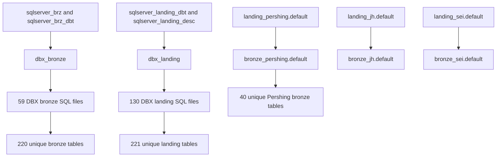

# Current State Overview

## Source Ingestion

```text
Source
 ↓
NiFi
 ↓
Central Repository
 ↓
Airflow
 ↓
DW Landing
```

## DBX Layer Refresh

Refreshed from the local filesystem on 2026-07-30.



## Children
