# SqlServerConsolidationEpic

# Epic: SQL Server Consolidation Readiness Assessment

## 1. Epic Summary

**Epic ID:** TBD

**Owner:** TBD

**Technical Lead:** TBD

**Status:** Draft / Discovery

**Target Release:** TBD

**Created Date:** TBD

**Last Updated:** 2026-08-04

### 1.1 Executive Summary

This epic establishes a governed current-state assessment for Bradesco Miami SQL Server databases so the team can make defensible consolidation, migration, retention, redesign, or retirement recommendations.

The current evidence shows 58 inventoried servers, 48 rows marked in scope for Microsoft SQL Server, 178 database records, approximately 4,032.5 GB of database footprint, and 176 databases still in pending analysis. No database is currently classified as migration-ready. The immediate blocker is not only connectivity: read-only SQL access can identify database metadata, but application owners, business owners, developers, and vendors are required to validate purpose, integrations, reporting dependencies, criticality, operational status, and migration suitability.

This epic covers the discovery and readiness phase. It does not authorize production change, shutdown, decommissioning, or migration execution.

### 1.2 Source Evidence Used

Only files in `wiki/di/3/Epics/` were used:

- `Bradesco_SQL_Assessment_v2_shared 1.xlsx`
- `Bradesco_Databases_Caddiel_Campos_Technical_Owners_v1.xlsx`
- `Bradesco_Databases_Renan_Silva_Technical_Owners_v1.xlsx`
- `Detailed_Meeting_Summary_DB_Consolidation_Infra_20260724_EN.docx`

## 2. Business Context

### 2.1 Business Problem

Bradesco Miami has a broad SQL Server estate with incomplete visibility into database ownership, usage, dependencies, criticality, and migration disposition. Infrastructure inventory identifies hosts, technologies, IPs, and some server-level attributes, but that does not explain why each database exists or what business, ETL, reporting, vendor, or operational workflows depend on it.

If this work is not completed, the organization risks:

- Making consolidation or cloud migration decisions from incomplete technical metadata.
- Migrating, retaining, or retiring databases without validated business ownership.
- Underestimating application, ETL, reporting, and vendor dependencies.
- Spending assessment effort on duplicate, inactive, non-SQL Server, or obsolete records.
- Leaving end-of-support SQL Server instances and access gaps unmanaged.

### 2.2 Business Goals

| Goal | Description | Success Indicator |
| --- | --- | --- |
| Establish a reliable SQL Server inventory | Validate which servers and databases are actually in scope for SQL Server assessment. | In-scope, out-of-scope, duplicate, inactive, and vendor-managed records are classified with evidence. |
| Complete ownership discovery | Map each in-scope server/database to technical, functional, application, business, or vendor contacts. | Each in-scope database has a named accountable contact or documented escalation path. |
| Enable defensible disposition recommendations | Collect enough context to recommend migration, consolidation, retention, redesign, retirement, or decommissioning. | Databases move from `Pending analysis` to an approved migration/disposition status. |
| Reduce assessment blockers | Resolve access and ownership gaps that prevent repeatable discovery across the estate. | Read-only access or authoritative database exports are available for remaining in-scope hosts. |

## 3. Scope

### 3.1 In Scope

- SQL Server inventory and readiness assessment for Bradesco Miami.
- Server-level validation for Microsoft SQL Server hosts, including version, environment, criticality, support status, HA/DR indicator, access status, and review status.
- Database-level discovery for purpose, application ownership, technical ownership, source systems, ETL dependencies, reporting usage, consumers, operational status, and migration disposition.
- Read-only technical metadata collection or equivalent exported database lists for in-scope hosts.
- Ownership mapping using Infrastructure, DevOps/team leads, developers, business contacts, and vendor contacts.
- Classification of duplicate, inactive, non-SQL Server, SQL Compact, LocalDB, and "no business databases found" records.
- Prioritization of discovery interviews by database count, criticality, ownership clarity, and access availability.

### 3.2 Out of Scope

- Production migration execution.
- Production write access, configuration changes, shutdowns, or decommissioning actions.
- Final target-platform implementation until current-state discovery and disposition recommendations are approved.
- Non-SQL Server technologies such as MySQL or MongoDB, once validated as outside the SQL Server assessment scope.
- Application refactoring or vendor contract changes, except where required as dependencies for future planning.

## 4. Users and Stakeholders

| Role | Name / Team | Responsibility |
| --- | --- | --- |
| Business Owner | TBD | Owns business value, prioritization, and final business acceptance. |
| Product Owner | TBD | Owns backlog, sequencing, and acceptance criteria. |
| Technical Lead / Architect | TBD | Owns assessment approach, target-state design inputs, and technical recommendations. |
| Assessment Team | NTT Assessment Team | Builds current-state view, conducts discovery, and prepares readiness recommendations. |
| Infrastructure Lead | Rodney Laurent / Infrastructure | Supports server identification, access change request, and owner/team-lead routing. |
| Program / Coordination | Enrique Escobar | Participates in coordination and may be included in follow-up review meetings. |
| Technical Contacts | Rafael, Igor, Renan, Gregory, Eric Luis, Yanniel, Andres Paulino, Ivan Sanchez, Caddiel Campos, others TBD | Validate technical ownership, application usage, sources, dependencies, and operational context. |
| Vendor Contacts | Ocean System, Prologue, others TBD | Support vendor-managed system validation and future change coordination. |
| Data / Application Owners | Devs, IT Operations Team, DataWarehouse, Operations Department, BSA, Finance, Corporate Security, vendors | Explain business usage, criticality, reporting, integrations, and disposition constraints. |
| QA / Validation | TBD | Validates assessment completeness, data quality checks, and business sign-off evidence. |

## 5. Current State

The current assessment workbook contains server and database views used to track SQL Server consolidation readiness. The server inventory originated from infrastructure input and includes server identifiers, host names, IP information, installed database technologies, environments, ownership fields, in-scope flags, access status, and review status. The database sheet links database records to server IDs and includes fields for SQL version, state, size, backup information, ownership, purpose, sources, dependencies, migration status, recommendation, and discovery source.

### 5.1 Current-State Metrics

| Metric | Current Value |
| --- | ---: |
| Total server rows | 58 |
| In-scope MSSQL rows | 48 |
| Out-of-scope / non-MSSQL rows | 10 |
| Total database records | 178 |
| Total database size | 4,032.5 GB |
| Servers with database records | 13 |
| Migration-ready databases | 0 |
| Databases pending analysis | 176 |
| Databases marked retire | 2 |
| Servers with access marked Yes | 7 |
| Servers with access marked No | 51 |
| Servers reviewed Yes | 2 |
| Servers reviewed No | 56 |

### 5.2 Current-State Challenges

- Read-only access exists for only a limited portion of the SQL Server estate.
- Database-level owners are unknown for many records.
- 159 of 178 database records have blank `Application / Functional Owner`.
- 176 of 178 database records remain in `Pending analysis`.
- 128 of 178 database records have `Environment` as `Pending validation`.
- 160 of 178 database records have blank `Criticality`.
- 157 of 178 database records have blank `Recommendation`.
- Some records appear duplicate or inconsistent across server/product classification.
- Some servers are marked with SQL installed but no business databases found, while related database counts still require clarification.
- SQL Compact and LocalDB entries require explicit scope validation.
- Vendor-managed databases require separate engagement and approval paths.
- HA/DR relationships are not yet mapped to specific paired servers.

### 5.3 Current Systems

| Server ID | Host / System | Engine / Version | Environment | Database Count | Access | Technical Owner | Business Owner | Notes |
| --- | --- | --- | --- | ---: | --- | --- | --- | --- |
| SRV-002 | BACBPTRANSDB1 | SQL Server 2016 Standard | Production | 40 | No | IT Operations Team, Rena Silva | Devs | Login/domain and server-found issues recorded. |
| SRV-026 | BFBNAPDB | SQL Server 2016 Standard | Production | 36 | Yes | IT Operations Team, Rena Silva | Devs | Current detailed discovery example. |
| SRV-052 | UATSYNDB | SQL Server 2019 Standard | Staging/UAT | 35 | No | IT Operations Team, Rena Silva | IT Operations Team, Devs | Duplicate noted in server inventory. |
| SRV-006 | BACSANSRV | SQL Server 2017 Express | Production | 23 | Yes | IT Operations Team | IT Operations Team | Needs clarification because notes say no business databases found. |
| SRV-057 | sqlserver-7db9877b68-6h74t | SQL Server 2022 | Development | 10 | Yes | Renan Silva | Devs | Discovery source: Devs NiFi. |
| SRV-036 | BFBJXWORKFLOWDB | SQL Server 2019 Standard | Production | 7 | Yes | IT Operations Team | Operations Department | JX/workflow area requires owner validation. |
| SRV-053 | BB-VV-BD-006 | SQL Server 2022 | Production | 6 | Yes | IT Operations Team | DataWarehouse | Includes large DQP databases. |
| SRV-015 | BB-VV-BD-001 | SQL Server 2019 Standard | Production | 5 | Yes | IT Operations Team | DataWarehouse | Notes mention SQLEXPRESS 2017 version detected. |
| SRV-056 | BB-VV-BD-008 | SQL Server 2022 | Development | 5 | No | Renan Silva | Devs | Linked Server from NiFi Dev. |
| SRV-058 | sqlserver-6d45bcd4bf-vz9k2 | SQL Server 2022 | Development | 5 | Yes | Renan Silva | Devs | Discovery source: Devs NiFi. |
| SRV-029 | BFBDSNAP | SQL Server 2019 Standard | Production | 4 | No | IT Operations Team, Rena Silva | Devs | Database owner details still incomplete. |
| SRV-054 | BB-VV-BD-005 | SQL Server 2019 Standard | Production | 1 | No | IT Operations Team | DataWarehouse | Requires access and functional validation. |
| SRV-055 | BFB-FEDLINK | SQL Server 2019 Standard | Production | 1 | No | IT Operations Team | Operations Department | FedLink ownership/use requires confirmation. |

### 5.4 Known Ownership Inputs

| Source | Owner Information |
| --- | --- |
| Caddiel Campos workbook | 56 database rows mapped to Caddiel Campos and related contacts across BFBSYNDB, BFBJXSERVERDB\\JXCHANGE, BB-VV-BD-004, and BB-VV-AP-009. |
| Caddiel Campos workbook | BFBSYNDB has 24 rows mapped to Caddiel Campos and Rodney Laurent. |
| Caddiel Campos workbook | BFBJXSERVERDB\\JXCHANGE has 21 rows mapped to Caddiel Campos. |
| Caddiel Campos workbook | BB-VV-BD-004 has 10 rows mapped to Caddiel Campos, Rodney Laurent, and Infra. |
| Caddiel Campos workbook | BB-VV-AP-009 has 1 row mapped to Caddiel Campos, Paul Ippolito, and vendor Prologue. |
| Renan Silva workbook | 53 database rows list server/database combinations but the technical owner field is blank for all rows. |
| Renan Silva workbook | Rows include BFBORLDB, UATSYNDB, BFBDSNAP, BFBORLLC, BBFBDBVIEW, BFBREPORTS, BACBPTRANSDB1, and BB-VV-BD-005. |

## 6. Target State

The target state is a validated SQL Server readiness baseline that can support later architecture and migration decisions. Each in-scope server and database should have technical visibility, ownership, functional context, criticality, usage/dependency data, and an approved disposition recommendation.

### 6.1 Target-State Capabilities

- Evidence-based scope classification for SQL Server, non-SQL Server, duplicate, inactive, and vendor-managed records.
- Read-only access or authoritative exported inventory for every remaining in-scope SQL Server host.
- Database-level owner map including technical owner, functional/application owner, business contact, and vendor contact where applicable.
- Discovery interview model that captures purpose, sources, ETL, reports, consumers, execution frequency, dependencies, operational status, and criticality.
- Migration/disposition framework covering lift and shift, rehost, replatform, refactor, repurchase, retain, retire, decommission, investigate, and pending validation.
- Prioritized backlog of servers/databases for consolidation or migration planning.
- Data quality and reconciliation checks for inventory completeness and classification consistency.

### 6.2 Target Architecture Summary

The final target architecture is TBD. This epic prepares the input needed for architecture decisions by building a governed current-state baseline. After discovery is complete, the team can group databases by application, owner, criticality, version, support status, environment, dependency pattern, and migration suitability to define future waves for consolidation, modernization, or retirement.

## 7. Architecture and Design

### 7.1 High-Level Discovery Flow

```mermaid
flowchart LR
    A["Infrastructure inventory"] --> B["Server scope validation"]
    B --> C["Read-only SQL access or exported database lists"]
    C --> D["Database metadata capture"]
    D --> E["Owner and vendor mapping"]
    E --> F["Discovery interviews"]
    F --> G["Dependency and usage validation"]
    G --> H["Migration / consolidation disposition"]
    H --> I["Prioritized delivery backlog"]
```

### 7.2 Design Principles

- Treat technical metadata as evidence of what exists, not why it exists.
- Require stakeholder validation before recommending migration, retirement, or decommissioning.
- Keep assessment access read-only and non-invasive.
- Classify non-SQL Server and irrelevant hosts out of scope only after validation.
- Separate infrastructure ownership from application, functional, and business ownership.
- Use vendor-specific engagement paths for vendor-managed databases.

## 8. Data Requirements

### 8.1 Source Data

| Source System | Object / Table / API | Description | Refresh Frequency | Owner |
| --- | --- | --- | --- | --- |
| Infrastructure inventory | Server list | Server ID, hostname, IP, location, network, installed engine/product, environment, owner fields, scope flags. | As inventory changes / assessment refresh | Infrastructure Team |
| SQL Server instances | Database metadata | Database name, version, state, size, last backup, data/log file locations, server linkage. | During discovery and before final recommendation | Infrastructure / SQL access owners |
| Assessment workbook | Servers and Databases tabs | Working tracker for scope, access, ownership, migration status, and recommendations. | Active assessment updates | NTT Assessment Team |
| Owner mapping workbooks | Caddiel and Renan database owner files | Supplemental owner mapping by server/database. | As owner mapping is updated | Named technical/functional contacts |
| Discovery interviews | Stakeholder responses | Purpose, usage, sources, ETL, reports, consumers, dependencies, operational status, criticality, and vendor context. | Per discovery wave | Assessment Team + application/business contacts |

### 8.2 Target Data Products

| Data Product | Description | Consumer | SLA | Owner |
| --- | --- | --- | --- | --- |
| SQL Server current-state inventory | Validated server and database inventory with scope, access, ownership, and metadata. | Assessment Team, Infrastructure, application teams | TBD | NTT Assessment Team |
| Ownership and dependency map | Mapping of databases to owners, vendors, source systems, ETL, reports, consumers, and dependencies. | Assessment Team, business/application owners | TBD | TBD |
| Migration readiness backlog | Prioritized list of databases and servers with disposition recommendations and blockers. | Program leadership, architecture, delivery teams | TBD | TBD |
| Open question / blocker log | Questions that must be resolved before approval. | Assessment Team and stakeholders | TBD | NTT Assessment Team |

### 8.3 Key Business Entities

| Entity | Definition | Source of Truth | Notes |
| --- | --- | --- | --- |
| Server | Host or instance container where database technologies are installed. | `2. Servers` tab | One server can have multiple products/instances and duplicate records requiring validation. |
| SQL Server Instance | Independent SQL Server installation on a server. | Infrastructure inventory / SQL Server access | Versions include SQL Server 2008/R2, 2012, 2016, 2017, 2019, 2022, LocalDB, and Compact variants. |
| Database | Named data collection linked to a server ID. | `3. Databases` tab | One row equals one database record. |
| Owner | Technical, functional, application, business, or vendor contact accountable for knowledge or decisions. | Owner workbooks and discovery interviews | Many database owner fields remain blank or pending. |
| Dependency | Source, ETL, report, workflow, consumer, vendor, or application relying on a database. | Discovery interviews and documentation | Required before migration disposition is defensible. |
| Migration Disposition | Recommended path such as migrate, rehost, replatform, retain, retire, decommission, or investigate. | Assessment workbook after validation | Currently mostly pending analysis. |

## 9. Functional Requirements

| ID | Requirement | Priority | Acceptance Criteria |
| --- | --- | --- | --- |
| FR-001 | Validate the SQL Server assessment scope across all inventoried server rows. | Must | Each server row is classified as in scope, out of scope, duplicate, inactive, vendor-managed, or pending with evidence. |
| FR-002 | Obtain read-only SQL access or authoritative exported database listings for in-scope hosts. | Must | Remaining in-scope hosts have either read-only access available or an approved exported inventory alternative. |
| FR-003 | Map server and database ownership. | Must | Each in-scope database has a technical, functional, business, application, or vendor owner, or a documented escalation path. |
| FR-004 | Conduct targeted discovery interviews. | Must | Interviews capture purpose, sources, ETL, reports, consumers, execution frequency, dependencies, operational status, and criticality. |
| FR-005 | Update migration status and recommendations. | Must | Databases move out of `Pending analysis` only when supporting technical and functional evidence exists. |
| FR-006 | Validate duplicate and inconsistent inventory records. | Must | Duplicate records and conflicting product/scope notes are resolved or documented as open blockers. |
| FR-007 | Identify vendor-managed systems. | Should | Vendor-managed databases have vendor name, contact path, and engagement constraints documented. |
| FR-008 | Prioritize next assessment waves. | Should | Databases are grouped by server, owner, application, criticality, access availability, and complexity. |
| FR-009 | Maintain an open question and blocker log. | Must | Open questions have owner, status, and resolution notes. |

## 10. Non-Functional Requirements

| Category | Requirement | Target |
| --- | --- | --- |
| Performance | Assessment queries must be read-only and avoid production impact. | Non-invasive metadata collection only. |
| Availability | Assessment activities must not require downtime. | No production shutdown, restart, or configuration change in this epic. |
| Security | Access must be limited to named assessment participants and read-only permissions. | Formal change request or approved access process. |
| Data Quality | Inventory fields must be validated before use in recommendations. | No assumptions for owner, purpose, criticality, environment, or disposition. |
| Observability | Blockers, access status, review status, and open questions must remain visible. | Workbook/backlog reflects current status. |
| Scalability | Discovery process must scale across high-density servers. | Group interviews by owner/application/server and prioritize by complexity. |
| Compliance | Sensitive data handling and approval requirements must be confirmed before deeper analysis. | PII, retention, audit, and access rules documented before implementation planning. |

## 11. Data Quality and Validation

### 11.1 Data Quality Rules

| Rule ID | Rule Description | Severity | Validation Method |
| --- | --- | --- | --- |
| DQ-001 | Every in-scope SQL Server row must have access status and review status. | High | Workbook completeness check. |
| DQ-002 | Every in-scope database must have a validated owner or escalation path. | Critical | Owner workbook reconciliation and stakeholder confirmation. |
| DQ-003 | Database migration status cannot move from `Pending analysis` without owner, purpose, dependency, and operational status evidence. | Critical | Assessment review and approval checkpoint. |
| DQ-004 | Duplicate server/database records must be confirmed using hostname, engine/product, instance, and database evidence. | High | Inventory reconciliation. |
| DQ-005 | Non-SQL Server, SQL Compact, LocalDB, and no-business-database records must be explicitly classified. | High | Infrastructure validation and owner confirmation. |
| DQ-006 | Criticality cannot remain blank for databases that are candidates for migration or retirement. | High | Discovery interview evidence. |
| DQ-007 | Last backup and database state must be captured before migration readiness assessment. | Medium | SQL metadata query or authoritative export. |

### 11.2 Reconciliation Requirements

- Source-to-target record count validation: reconcile server rows, SQL Server in-scope rows, and database counts against SQL Server metadata exports.
- Balance / amount reconciliation: not applicable unless a database-specific financial data migration is later approved.
- Duplicate detection: validate duplicate server and database records using hostname, instance, engine, IP, and owner input.
- Null checks: owner, environment, criticality, purpose, source, dependency, migration status, and recommendation fields must be reviewed for blanks.
- Referential integrity: every database row must map to a valid server ID in the server inventory.
- Business-rule validation: migration status and recommendation must be based on validated purpose, usage, owner, dependency, and operational status.

### 11.3 Open Questions From Assessment Workbook

| ID | Topic | Question | Status |
| --- | --- | --- | --- |
| Q1 | Duplicates / Engine | For duplicates, was the engine/product taken into account when identifying them? | Open |
| Q2 | Databases in Scope | For "no business databases found", does this mean databases do not exist, are not used, or are not managed by Bradesco? BACSANSRV has 23 DBs and needs ownership/purpose clarification. | Open |
| Q3 | Access & Ownership | How will server access be granted, escalated, and mapped to database owners? | Open |
| Q4 | Scope / SQL Compact | Can SQL Compact instances be treated as out of scope, or do they contain application-used databases? | Open |
| Q5 | Data Quality | BFBWEBDEV runs MSSQL 2019 but has a note saying "Non-MSSQL product detected"; which value is correct? | Open |
| Q6 | HA / DR | Which servers are actual DR pairs, for example BBFBDBVIEW and related systems? | Open |

## 12. Security, Governance, and Compliance

### 12.1 Access Control

| Role / Group | Access Level | Data Scope |
| --- | --- | --- |
| NTT Assessment Team | Read-only | SQL Server metadata for approved in-scope hosts. |
| Infrastructure Team | Admin / provisioning per existing role | Server identification, connectivity, access request support, and technical validation. |
| Application / Functional Owners | Read / review | Application purpose, dependencies, reports, and operational context for owned databases. |
| Vendor Contacts | TBD | Vendor-managed databases only, subject to contract and approval path. |
| Business Owners | Review / approve | Business validation, criticality, disposition, and sign-off. |

### 12.2 Governance Requirements

- Data classification: TBD per database; must be confirmed before implementation planning.
- PII / sensitive data handling: TBD; discovery must identify sensitive datasets and access constraints.
- Data retention: TBD; retention requirements must be captured before retirement or decommissioning decisions.
- Audit logging: access requests and assessment actions should be traceable through the formal change process.
- Lineage: source systems, ETL jobs, reports, and downstream consumers must be documented during discovery.
- Approval workflow: production changes, migration, retirement, and decommissioning require separate approval outside this epic.
- Business glossary updates: glossary terms and disposition definitions should remain aligned with the assessment workbook.

## 13. Dependencies

| Dependency | Type | Owner | Status | Notes |
| --- | --- | --- | --- | --- |
| Read-only SQL access / exported database lists | System / Access | Rodney Laurent / Infrastructure | Open | Required for remaining in-scope SQL Server hosts. |
| Named assessment participants for access request | Team | NTT Assessment Team | Open | Meeting notes state names must be provided. |
| Server/database owner mapping | Team / Data | Rodney Laurent / Infrastructure / team leads | Open | Needed to route focused interviews. |
| Application and functional owner interviews | Team | Application owners / business contacts | Open | Required to validate purpose, dependencies, consumers, and criticality. |
| Vendor-managed database contacts | Vendor | Infrastructure / business owner / vendor | Open | Ocean System and Prologue referenced as vendor paths needing validation. |
| Duplicate and scope classification | Data | Infrastructure + Assessment Team | Open | Required for SQL Compact, LocalDB, duplicate, inactive, and non-SQL records. |
| Target architecture decision | Architecture | TBD | Open | Depends on completed current-state assessment and disposition recommendations. |

## 14. Risks and Mitigations

| Risk | Impact | Probability | Mitigation | Owner |
| --- | --- | --- | --- | --- |
| Access provisioning is delayed or incomplete. | High | High | Track formal change request; use authoritative exported database lists as interim evidence. | Infrastructure |
| Owner information remains incomplete or outdated. | High | High | Use Infrastructure, DevOps leads, developers, business contacts, and vendor contacts to triangulate ownership. | Assessment Team / Infrastructure |
| Legacy or inactive databases remain mixed with active workloads. | High | Medium | Validate operational status through owner confirmation, usage evidence, and recent activity. | Application Owners |
| Vendor-managed databases require external coordination. | Medium | Medium | Identify vendors early and establish separate engagement and approval path. | Business / Vendor Owner |
| Database volume is uneven across servers. | Medium | Medium | Prioritize high-density servers and group interviews by owner/application. | Assessment Team |
| Inconsistent inventory values lead to wrong scope decisions. | High | Medium | Resolve open workbook questions before final classification. | Assessment Team / Infrastructure |
| End-of-support SQL versions remain in production. | High | Medium | Flag EOS instances for prioritized remediation planning after assessment. | Architecture / Infrastructure |

## 15. Delivery Plan

### 15.1 Milestones

| Milestone | Target Date | Owner | Status |
| --- | --- | --- | --- |
| Infrastructure coordination meeting completed | 2026-07-24 | NTT Assessment Team / Infrastructure | Complete |
| Initial Infrastructure owner/access update | 2026-07-27 12:00 PM, timezone not stated | Rodney Laurent | Planned / Needs confirmation |
| Monday review meeting | 2026-07-27 2:00 PM, timezone not stated | NTT Assessment Team + Infrastructure | Planned / Needs confirmation |
| Read-only access or exported database lists available | TBD | Infrastructure | Not Started |
| Owner mapping first pass complete | TBD | Infrastructure / team leads | Not Started |
| Discovery interviews completed for priority wave | TBD | Assessment Team | Not Started |
| Scope and duplicate classifications approved | TBD | Assessment Team / Infrastructure | Not Started |
| Migration/disposition recommendations drafted | TBD | Assessment Team / Architecture | Not Started |
| Business validation complete | TBD | Business / Application owners | Not Started |

### 15.2 Work Breakdown

| Workstream | Description | Owner | Status |
| --- | --- | --- | --- |
| Inventory validation | Confirm server and database inventory accuracy, scope, duplicates, inactive records, and product classification. | Assessment Team / Infrastructure | In Progress |
| Access enablement | Submit and track read-only SQL access request or collect authoritative database exports. | Rodney Laurent / Infrastructure | Open |
| Ownership mapping | Map each server/database to technical, functional, business, application, or vendor contacts. | Infrastructure / team leads | Open |
| Discovery interviews | Capture database purpose, sources, ETL, reports, consumers, execution frequency, dependencies, and operational status. | Assessment Team | Not Started |
| Data quality | Resolve blanks and inconsistent fields in owner, environment, criticality, recommendation, status, and scope. | Assessment Team | Open |
| Migration readiness | Convert validated evidence into disposition recommendations and prioritized backlog. | Assessment Team / Architecture | Not Started |
| Governance | Confirm access, classification, retention, lineage, and approval requirements. | Security / Governance / Business | Not Started |

## 16. Jira / Backlog Links

| Item Type | Key / Link | Description |
| --- | --- | --- |
| Epic | TBD | SQL Server Consolidation Readiness Assessment |
| Story | TBD | Validate server scope and duplicate records. |
| Story | TBD | Obtain read-only SQL access or exported database lists. |
| Story | TBD | Complete owner mapping for in-scope databases. |
| Story | TBD | Conduct discovery interviews for priority database groups. |
| Story | TBD | Produce migration/disposition recommendations. |
| Spike | TBD | Evaluate target-state consolidation / cloud migration architecture options after discovery. |
| Defect | TBD | Resolve inconsistent inventory classifications such as BFBWEBDEV. |

## 17. Acceptance Criteria

The epic is complete when:

- Business requirements are reviewed and approved.
- Architecture and design inputs are reviewed and approved for the next delivery phase.
- Required source data is available and validated.
- All in-scope SQL Server hosts have read-only access or an approved exported inventory alternative.
- Server scope classifications are complete for SQL Server, non-SQL Server, duplicate, inactive, SQL Compact, LocalDB, and vendor-managed records.
- Each in-scope database has an owner or documented escalation path.
- Database purpose, source systems, ETL dependencies, reporting consumers, execution frequency, operational status, and criticality are captured for in-scope databases.
- Open workbook questions are answered or formally carried as approved exceptions.
- Migration/disposition recommendations are populated and supported by evidence.
- Security and access controls are documented.
- Governance requirements for data classification, PII/sensitive data, retention, audit, lineage, and approvals are documented.
- Documentation is complete and traceable to the assessment workbook, owner mapping workbooks, and meeting summary.
- Business validation is complete.
- Monitoring and support handoff requirements for the next phase are documented.

## 18. Known Information Still Needed

- Jira Epic key / reference.
- Business Owner and Product Owner.
- Technical Lead / Architect.
- Target release / PI / quarter.
- Confirmed final status after stakeholder review.
- Confirmed assessment participant names for access request.
- Confirmed July 27, 2026 follow-up outcomes.
- Final access decision per in-scope host.
- Final owner map per database.
- Final target architecture / platform decision.
- Security groups, approval workflow, data retention, and sensitive-data classification.
- Final business acceptance and sign-off process.

## 19. Operational Readiness

| Area | Requirement | Status |
| --- | --- | --- |
| Monitoring | Track access status, reviewed status, pending analysis count, owner mapping completeness, and open blocker resolution. | Not Started |
| Alerting | TBD for future implementation phase; no production alerting changes are authorized by this discovery epic. | Not Started |
| Runbook | Document read-only assessment process, owner interview process, evidence requirements, and disposition approval steps. | Not Started |
| Support Model | Infrastructure supports access and technical status checks; application/business/vendor owners support usage validation. | Draft |
| SLA / SLO | TBD after target architecture and disposition recommendations are approved. | Not Started |

## 20. Open Questions

| Question | Owner | Due Date | Status |
| --- | --- | --- | --- |
| Were duplicate records identified using both hostname and engine/product? | Infrastructure / Assessment Team | TBD | Open |
| Does "no business databases found" mean absent, unused, unmanaged, or pending ownership validation? | Infrastructure / Application Owners | TBD | Open |
| Who should receive read-only access, and what is the approved access path per in-scope host? | NTT Assessment Team / Rodney Laurent | TBD | Open |
| Are SQL Compact and LocalDB instances in scope when no application-used databases are present? | Infrastructure / Application Owners | TBD | Open |
| Which value is correct for inconsistent records such as BFBWEBDEV where MSSQL is listed but notes say non-MSSQL? | Infrastructure / Assessment Team | TBD | Open |
| What are the confirmed HA/DR server pairings? | Infrastructure | TBD | Open |
| Which databases are vendor-managed, and who owns vendor engagement for Ocean System, Prologue, and any other vendors? | Business Owners / Infrastructure | TBD | Open |

## 21. Decision Log

| Date | Decision | Owner | Notes |
| --- | --- | --- | --- |
| 2026-07-24 | Limit the current assessment to SQL Server databases. | NTT Assessment Team / Infrastructure | MySQL and other non-SQL Server technologies may be classified out of scope after validation. |
| 2026-07-24 | Use read-only access or authoritative exported database lists for technical discovery. | Rodney Laurent / Infrastructure | No write, configuration, shutdown, or production change permissions were requested. |
| 2026-07-24 | Combine technical metadata with stakeholder interviews before producing migration recommendations. | NTT Assessment Team | Metadata explains what exists; owners explain usage, criticality, dependencies, and business impact. |
| 2026-07-24 | Use Infrastructure, team leads, developers, business contacts, and vendors to route ownership discovery. | Rodney Laurent / Infrastructure | Infrastructure ownership alone is not sufficient for database disposition decisions. |

## 22. Related Documents

- Architecture diagram: TBD
- Data dictionary: `Bradesco_SQL_Assessment_v2_shared 1.xlsx`, `6. Glossary` tab
- Source-to-target mapping: TBD after target architecture is approved
- Business glossary: `Bradesco_SQL_Assessment_v2_shared 1.xlsx`, `6. Glossary` tab
- Assessment workbook: `Bradesco_SQL_Assessment_v2_shared 1.xlsx`
- Owner mapping: `Bradesco_Databases_Caddiel_Campos_Technical_Owners_v1.xlsx`
- Owner mapping: `Bradesco_Databases_Renan_Silva_Technical_Owners_v1.xlsx`
- Meeting summary: `Detailed_Meeting_Summary_DB_Consolidation_Infra_20260724_EN.docx`
- Security review: TBD
- Test plan: TBD
- Release plan: TBD

## 23. Change Log

| Date | Change | Author |
| --- | --- | --- |
| 2026-08-04 | Populated discovery Epic from the assessment workbook, owner mapping workbooks, and infrastructure coordination meeting summary. | Codex |

## Recommended Confluence Labels

Add these labels to the page:

- sql-server
- consolidation
- readiness-assessment
- database-inventory
- infrastructure
- data-governance
- migration-planning

# Epic Children

| Child Type | Draft Title | Purpose | Status |
| --- | --- | --- | --- |
| Story | Validate SQL Server scope and duplicate inventory records | Resolve in-scope, out-of-scope, duplicate, inactive, SQL Compact, LocalDB, and non-SQL classifications. | Draft |
| Story | Obtain read-only SQL access or exported database lists | Enable repeatable metadata collection for remaining in-scope hosts. | Draft |
| Story | Complete database owner mapping | Assign technical, functional, application, business, or vendor owners to in-scope databases. | Draft |
| Story | Conduct priority discovery interviews | Capture purpose, sources, dependencies, reports, consumers, schedules, criticality, and operational status. | Draft |
| Story | Resolve workbook open questions | Close known assessment questions before final disposition recommendations. | Draft |
| Story | Draft migration and consolidation disposition recommendations | Convert validated evidence into a prioritized recommendation backlog. | Draft |
| Spike | Evaluate target architecture options | Assess consolidation/cloud migration options after current-state validation is complete. | Draft |
