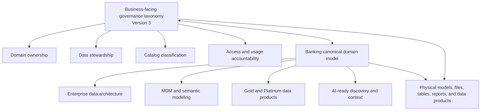
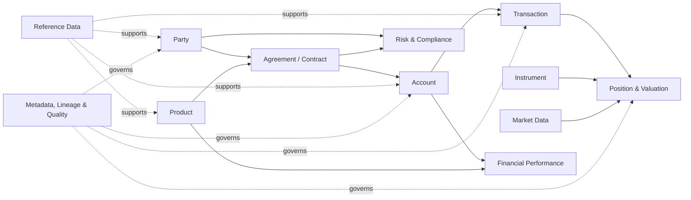
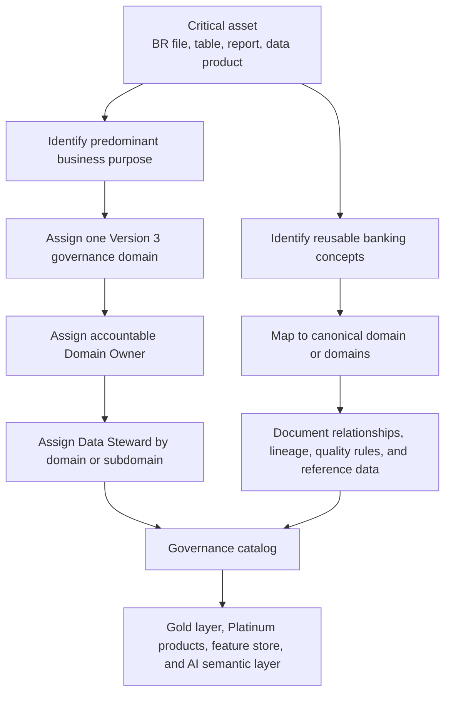

# Bradesco Bank Data Domains


# 1. Purpose

This document presents the evaluation of three alternative data-domain models for Bradesco and recommends **Version 3, the hybrid model**, as the target approach.

The exercise was performed to define a domain structure that:

- supports clear Data Owner and Data Steward assignments;
- is understandable to both business and technical stakeholders;
- reflects stable banking concepts rather than temporary organizational structures;
- provides practical boundaries for critical data assets and future data products;
- supports metadata management, data quality, security, analytics, and AI initiatives; and
- can be expanded as additional critical BR files, tables, and data products enter the governance scope.

The three models evaluated were:

| **Version** | **Model** | **Primary organizing principle** |
| --- | --- | --- |
| V1 | Data-oriented | Foundational data objects, such as party, account, transaction, and position |
| V2 | Business-oriented | Business functions and organizational capabilities |
| V3 | Hybrid, recommended | Stable banking concepts that connect business accountability with recognizable data boundaries |


# 2. Executive Recommendation

Bradesco should adopt **Version 3 as the business-facing data-domain taxonomy**, while maintaining a separate but connected **banking canonical data-domain model** for architecture, Gold/Platinum data products, MDM, interoperability, and AI use cases.

The hybrid model provides the best balance between business clarity and data-governance discipline. It uses terms that business stakeholders recognize, such as **Customer & Relationship, Accounts, Deposits, Lending & Credit, Payments & Transfers, Investments, Financial Performance, and Treasury**, while preserving boundaries that data and technology teams can consistently apply to files, tables, reports, and data products.

Unlike a purely technical model, Version 3 does not require business users to interpret abstract entities such as *Party* or *Position & Valuation*. Unlike a purely business-oriented model, it is not a copy of the organizational chart and should therefore remain valid when departments, reporting lines, or responsibilities change.

Version 3 should be treated as the **enterprise governance classification structure**. Ownership should subsequently be assigned to each domain based on accountability for its business purpose and outcomes, not merely on which team produces or stores the data.

For long-term banking architecture, Version 3 should not be used alone as the canonical data model. The canonical layer should use stable banking concepts such as **Party, Account, Product, Agreement, Transaction, Position, Instrument, Financial Performance, Risk & Compliance, Reference Data, Market Data, and Metadata / Lineage / Quality**. These canonical domains should then be mapped back to the Version 3 governance domains for ownership, stewardship, and catalog classification.

# 3. Evaluation of the Three Models

## 3.1 Version 1: Data-Oriented Model

The data-oriented model organizes information according to foundational data objects.

**Domains evaluated:**

- Party
- Account
- Product
- Transaction
- Position & Valuation
- Risk & Compliance
- Financial Performance
- Market & Instrument
- Reference Data
- Metadata & Quality

### Strengths

- Provides technically consistent and relatively stable data categories.
- Aligns well with conceptual and logical data modeling.
- Helps architects identify reusable entities across systems and business processes.
- Is less dependent on the current organizational structure.

### Limitations

- Some names are not intuitive to business stakeholders. For example, *Party* may require explanation before it is understood as customer, organization, or other related entity.
- A data object may be used by several business areas, making executive ownership difficult to assign.
- Broad technical categories such as *Transaction* can combine payments, transfers, trading activity, account activity, and other events that may require different accountability.
- The model explains **what type of data exists**, but not always **which business capability is accountable for its meaning and quality**.

### Initial BR-file classification under V1

| **Critical BR file** | **V1 domain** |
| --- | --- |
| BR-01: Customer Master | Party |
| BR-02: Account Master | Account |
| BR-07: Account and Product Type Reference | Reference Data |
| BR-08: Customer-to-Account Relationships | Account |
| BR-09: Account Financial Performance | Financial Performance |
| BR-10: Investment Positions and Valuation | Position & Valuation |


## 3.2 Version 2: Business-Oriented Model

The business-oriented model organizes information according to business functions and areas of responsibility.

**Domains evaluated:**

- Client Management & Onboarding
- Products, Channels & Marketing
- Lending, Credit & Real Estate Finance
- Investments, Wealth & Custody
- Banking Operations & Client Services
- Finance, Treasury & Corporate Strategy
- Risk & Compliance
- Technology, Data & Information Security
- People & Organization
- Legal, Corporate Governance & Transformation

### Strengths

- Uses terminology that aligns closely with business functions.
- Makes it easier to identify potential owners from the current organizational structure.
- Is familiar to executives and business-area representatives.
- Helps connect data governance conversations to existing responsibilities.

### Limitations

- Closely resembles an organizational chart rather than a durable data classification.
- Domains may need to be renamed or reassigned after reorganizations.
- Some categories combine several distinct data responsibilities. For example, *Finance, Treasury & Corporate Strategy* contains capabilities that may require different owners, controls, and quality rules.
- Cross-functional data can be difficult to classify when multiple departments use or contribute to the same asset.
- Technology or corporate-function areas do not always represent coherent business-data domains.

### Initial BR-file classification under V2

| **Critical BR file** | **V2 domain** |
| --- | --- |
| BR-01: Customer Master | Client Management & Onboarding |
| BR-02: Account Master | Banking Operations & Client Services |
| BR-07: Account and Product Type Reference | Products, Channels & Marketing |
| BR-08: Customer-to-Account Relationships | Banking Operations & Client Services |
| BR-09: Account Financial Performance | Finance, Treasury & Corporate Strategy |
| BR-10: Investment Positions and Valuation | Investments, Wealth & Custody |


## 3.3 Version 3: Hybrid Model

The hybrid model combines business-recognizable banking concepts with stable data boundaries. It is neither a list of technical entities nor a reproduction of the organizational structure.

**Recommended domains:**

1. Customer & Relationship
2. Accounts
3. Deposits
4. Lending & Credit
5. Payments & Transfers
6. Investments
7. Risk & Compliance
8. Financial Performance
9. Treasury
10. Reference & Metadata

# 4. Recommended Domains and Subdomains

The subdomains below establish an initial level of decomposition. They provide more precise classification without weakening accountability at the primary-domain level. Each critical asset should have **one primary domain**, based on its main business purpose. A subdomain can then provide additional specificity.

## 4.1 Customer & Relationship

**Purpose:** Manage the identification, profile, lifecycle, onboarding, segmentation, and relationships of customers and related parties.

**Subdomains:**

- Party & Customer Master
- Customer Profile
- Customer Relationships & Households
- Customer Segmentation
- Customer Onboarding

## 4.2 Accounts

**Purpose:** Manage the core account record and the relationships, balances, availability, and activity associated with accounts that support banking products and customers.

**Subdomains:**

- Account Master
- Account Balances & Availability
- Account Activity
- Account Relationships

***Normalization note:** The source list contained overlapping entries for account balances and account activity. These were consolidated into the clearer subdomains shown above.*

## 4.3 Deposits

**Purpose:** Manage deposit products and their associated business data throughout the deposit lifecycle.

**Subdomains:**

- Demand Deposits
- Certificates of Deposit
- Overnight Deposits

## 4.4 Lending & Credit

**Purpose:** Manage lending products and the credit lifecycle, from assessment and underwriting through servicing and account activity.

**Subdomains:**

- Loan Master
- Loan Products
- Loan Activity
- Real Estate Lending
- Credit Assessment & Underwriting
- Credit Cards

## 4.5 Payments & Transfers

**Purpose:** Manage the initiation, movement, settlement, return, and exception handling of payments and transfers.

**Subdomains:**

- ACH Payments
- Wire Transfers
- Internal Transfers
- Cards & Card Payments
- Payment Settlement
- Returns & Exceptions
- Zelle

## 4.6 Investments

**Purpose:** Manage investment products, instruments, portfolios, strategies, holdings, positions, trades, and supporting market data.

**Subdomains:**

- Investment Products
- Financial Instruments
- Investment Portfolios
- Investment Strategies & Mandates
- Holdings & Positions
- Trading Orders & Executions
- Market Data

## 4.7 Risk & Compliance

**Purpose:** Manage risk information, regulatory controls, customer due diligence, monitoring, investigations, and audit or control findings.

**Subdomains:**

- Enterprise Risk
- Operational Risk
- Customer Risk
- KYC & Controls
- AML & Financial Intelligence
- Audit & Control Findings

## 4.8 Financial Performance

**Purpose:** Manage financial results and measures used to evaluate the bank, its products, customers, accounts, and business activities.

**Subdomains:**

- Valuation & Performance
- General Ledger Information
- Bank Financial Management

***Naming note:** “Ledger information” and “Finance of the bank” were refined to clearer, reusable subdomain names. Final terminology should be validated with Finance stakeholders.*

## 4.9 Treasury

**Purpose:** Manage the bank's cash position, liquidity, funding, foreign-exchange exposure, and treasury investment activities.

**Subdomains:**

- Cash Position
- Liquidity Management
- Funding
- Foreign Exchange
- Treasury Investments

## 4.10 Reference & Metadata

**Purpose:** Manage shared codes, classifications, calendars, definitions, and metadata needed to interpret, govern, and consistently use data across domains.

**Subdomains:**

- Business Reference Data
- Country Codes
- Calendar
- Metadata

***Governance note:** Reference & Metadata is a cross-cutting domain. Where a reference set is inseparable from one business capability, the business domain may remain the primary domain while Reference & Metadata is recorded as a secondary classification or supporting relationship.*

# 5. BR Critical-File Classification Using Version 3

The following table applies the recommended model to the BR files included in the original comparison.

| **Critical BR file** | **Business purpose** | **Recommended primary domain** | **Recommended subdomain** |
| --- | --- | --- | --- |
| BR-01: Customer Master | Customer identification, profile, documentation, referral, and relationship information | Customer & Relationship | Party & Customer Master |
| BR-02: Account Master | Core account record, ownership, status, lifecycle, product association, and summary measures | Accounts | Account Master |
| BR-07: Account and Product Type Reference | Reference mapping of account and product type codes and descriptions | Reference & Metadata | Business Reference Data |
| BR-08: Customer-to-Account Relationships | Relationship between customers and accounts, including relationship type | Accounts | Account Relationships |
| BR-09: Account Financial Performance | Account-level balances, revenue, profitability, interest, FTP, and income or expense measures | Financial Performance | Valuation & Performance |
| BR-10: Investment Positions and Valuation | Investment accounts, portfolios, instruments, quantities, prices, market values, accrued interest, and valuation dates | Investments | Holdings & Positions |


## Classification principle

A BR file should receive **one primary domain owner** based on its predominant business purpose. The presence of columns associated with other domains does not automatically create shared ownership.

For example, BR-10 contains customer and account identifiers, but its main purpose is to communicate investment positions and valuation. Its primary domain is therefore **Investments**, with **Holdings & Positions** as the recommended subdomain. Customer and account identifiers are relationships to other domains, not a reason to split primary accountability.

BR-07 requires special attention because it contains reference values for both account and product types. Under the Version 3 taxonomy, **Reference & Metadata** is the most consistent primary classification. If future review determines that the asset is governed primarily as part of the account-product lifecycle, it may be assigned to that business domain while retaining a reference-data classification. The final decision should still result in one accountable primary owner.

# 6. Why Version 3 Is the Best Option

## 6.1 It is understandable to business and technical teams

Version 3 uses recognizable banking terms without losing data precision. Business stakeholders can understand the purpose of **Deposits**, **Payments & Transfers**, or **Treasury**, while architects and engineers can map tables, columns, pipelines, and products to the same structure.

## 6.2 It enables clearer ownership

The recommended domains correspond to meaningful business outcomes and information responsibilities. This makes it easier to assign one accountable Domain Owner and supporting Data Stewards. Ownership is based on who is accountable for the data's business purpose, definition, quality, access, and appropriate use, rather than who happens to store or transmit it.

## 6.3 It remains stable through organizational change

Departments, reporting lines, and team names can change. Core banking concepts such as accounts, deposits, payments, investments, risk, and treasury remain comparatively stable. Version 3 can therefore survive reorganizations without requiring the enterprise taxonomy to be redesigned.

## 6.4 It reduces ambiguity in broad categories

The hybrid approach replaces overly broad technical categories such as *Transaction* with clearer domains such as **Payments & Transfers** and **Investments**. It also separates combined organizational categories such as *Finance, Treasury & Corporate Strategy* into **Financial Performance** and **Treasury**, which have different business purposes and likely different accountability.

## 6.5 It supports one primary domain per critical asset

The model supports a practical governance rule: classify each file, table, report, or data product according to its main business purpose and assign one primary domain. Cross-domain dependencies can be documented through secondary classifications, lineage, relationships, or referenced data elements without creating ambiguous shared accountability.

## 6.6 It supports future data products and AI initiatives

The model provides business context for governed data products and the future Platinum layer. Domain and subdomain metadata can help users and AI solutions discover relevant assets, interpret business meaning, identify accountable owners, apply access controls, and understand approved use. The same taxonomy can also support the enterprise catalog and MCP-enabled discovery layer.

## 6.7 It provides the right level of granularity

The ten primary domains are broad enough to remain manageable at the enterprise level. The subdomains add the specificity needed for stewardship, cataloging, data-quality rules, and asset classification. This avoids creating too many primary domains while still distinguishing important business areas.

# 7. Comparison Summary

| **Evaluation criterion** | **V1: Data-oriented** | **V2: Business-oriented** | **V3: Hybrid** |
| --- | --- | --- | --- |
| Business understandability | Medium | High | High |
| Technical consistency | High | Medium | High |
| Clear ownership assignment | Medium | Medium to High | High |
| Independence from organizational structure | High | Low | High |
| Stability over time | High | Low to Medium | High |
| Practical classification of BR files | Medium | Medium | High |
| Support for enterprise data products | Medium to High | Medium | High |
| Support for AI-ready business context | Medium | Medium | High |


# 8. Banking Data-Domain Strategy Assessment

Version 3 is the strongest option for governance adoption because it is understandable to business stakeholders and practical for assigning Data Owners and Data Stewards. However, as a banking data strategy, it should be positioned as the ownership taxonomy rather than the only enterprise data-domain model.

The main architectural risk is that the current taxonomy mixes several different kinds of concepts in one hierarchy:

| **Concept type** | **Examples in Version 3** | **Assessment** |
| --- | --- | --- |
| Business entities | Customer, Account, Relationship | Appropriate for governance, but should map to canonical concepts such as Party and Account. |
| Product families | Deposits, Lending & Credit, Credit Cards | Useful for ownership, but these should also map to a canonical Product and Agreement model. |
| Functional areas | Treasury, Financial Performance, Risk & Compliance | Useful for accountability, but these are not always canonical data entities. |
| Technical and governance concerns | Reference & Metadata | Should be handled as cross-cutting controls, with Reference Data separated from operational metadata, lineage, and data quality. |

This mixture is acceptable for an initial data-governance taxonomy, but it can limit maturity if the same hierarchy is used directly for canonical modeling, MDM, ISO 20022 alignment, BIAN alignment, Gold/Platinum data products, or AI semantic discovery.

## 8.1 Recommended Two-Layer Model

Bradesco should manage data domains through two connected layers:

| **Layer** | **Primary purpose** | **Recommended use** |
| --- | --- | --- |
| Governance domain taxonomy | Ownership, stewardship, business accountability, catalog classification | Use Version 3 as the approved business-facing taxonomy. |
| Banking canonical domain model | Data architecture, MDM, semantic modeling, enterprise data products, AI-ready context | Use stable banking entities and events that can survive organization and product changes. |

The governance layer answers: **Who owns the business meaning, quality, access, and appropriate use of the data?**

The canonical layer answers: **What reusable banking concept does the data represent, and how should it be modeled across systems and data products?**



## 8.2 Recommended Canonical Banking Domains

The following canonical domains should be maintained alongside Version 3:

| **Canonical domain** | **Purpose** |
| --- | --- |
| Party | People, organizations, customers, counterparties, beneficial owners, relationship managers, and other actors. |
| Account | Account master, account status, balances, availability, ownership, and account relationships. |
| Product | Deposit products, loan products, credit card products, investment products, terms, and product codes. |
| Agreement / Contract | Legal and commercial agreements connecting parties, accounts, and products. |
| Transaction | Payments, transfers, settlements, trades, fees, adjustments, and cash movements. |
| Position & Valuation | Holdings, cash positions, security positions, market values, accrued interest, and valuation balances. |
| Instrument | Securities, currencies, financial instruments, and instrument identifiers. |
| Financial Performance | Revenue, profitability, net interest income, FTP, ledger measures, income, and expense. |
| Risk & Compliance | KYC, AML, screening, risk ratings, regulatory status, tax documentation, and control evidence. |
| Reference Data | Shared codes, calendars, statuses, relationship types, currencies, branch codes, and product codes. |
| Market Data | FX rates, security prices, interest rates, currency data, and market reference values. |
| Metadata, Lineage & Quality | Technical metadata, lineage, processing metadata, audit information, data-quality rules, and data-quality results. |



## 8.3 Banking Maturity Assessment

| **Area** | **Assessment** | **Implication** |
| --- | --- | --- |
| Governance usability | Strong | Version 3 can support ownership and stewardship conversations. |
| Business readability | Strong | Domain names are understandable for executives and business SMEs. |
| Ownership assignment | Good | One primary owner per domain is practical, but owner mapping still needs validation. |
| Banking canonical modeling | Moderate | Canonical domains need to be separated from business domains and product families. |
| ISO 20022 alignment | Weak to moderate | Party, transaction, instrument, account, and settlement concepts need stronger representation. |
| BIAN alignment | Moderate | Business capability alignment is possible, but service-domain mapping is not yet explicit. |
| MDM readiness | Moderate | Party, Account, Product, and Reference Data should become explicit enterprise master-data domains. |
| AI/data product readiness | Moderate | The taxonomy helps discovery, but AI semantic layers need canonical entities, definitions, lineage, and quality signals. |
| Long-term scalability | Needs refinement | The strategy should avoid using one mixed hierarchy for all governance and architecture purposes. |

## 8.4 Recommended Classification Flow

Each critical asset should be classified through both lenses. The governance classification assigns accountability. The canonical classification defines the banking concept represented by the data and supports reusable modeling across layers.



# 9. Recommended Governance Principles

1. **One primary domain per critical asset.** Assign the domain based on the asset's predominant business purpose.
2. **One accountable Domain Owner per domain.** Supporting stakeholders may be consulted, but accountability should remain explicit.
3. **Use subdomains for specificity.** Subdomains support classification and stewardship without creating unnecessary top-level ownership structures.
4. **Do not classify only by columns.** Identifiers and attributes from other domains often appear in an asset; they do not necessarily determine ownership.
5. **Separate ownership from system custody.** The technology team or file-producing team is not automatically the business owner.
6. **Keep domains stable.** Organizational changes should trigger owner mapping updates, not automatic redesign of the domain taxonomy.
7. **Document cross-domain relationships.** Use lineage, metadata, related-domain fields, and data-product dependencies instead of shared primary ownership.
8. **Review ambiguous assets through governance.** Classification exceptions should be resolved using business purpose, authoritative source, and accountability for quality.
9. **Separate governance taxonomy from canonical modeling.** The same asset should have a business owner classification and, where relevant, a canonical banking-domain classification.
10. **Treat metadata, lineage, and data quality as cross-cutting controls.** They should support all domains rather than operate only as a standalone business domain.

## 9.1 Product Breakdown Structure

This section treats the data-domain strategy as an epic and decomposes it into the products that must exist for the strategy to be usable. The breakdown is product-oriented rather than activity-oriented: each item represents a deliverable, artifact, model, catalog object, governance object, or reusable classification asset.

The tree below is the primary Product Breakdown Structure. The table that follows provides the delivery-oriented definition of each product component.

```text
Bradesco Banking Data-Domain Strategy
|-- Governance Domain Taxonomy
|   |-- Version 3 Primary Domains
|   |-- Domain Definitions
|   |-- Subdomain Inventory
|   `-- Domain Classification Rules
|-- Canonical Banking Domain Model
|   |-- Canonical Domain Inventory
|   |-- Canonical Relationship Model
|   |-- Governance-to-Canonical Mapping
|   `-- ISO 20022 and BIAN Alignment Targets
|-- Critical Asset Classification
|   |-- BR-01 Customer Master Classification
|   |-- BR-02 Account Master Classification
|   |-- BR-07 Account and Product Type Reference Classification
|   |-- BR-08 Customer-to-Account Relationships Classification
|   |-- BR-09 Account Financial Performance Classification
|   `-- BR-10 Investment Positions and Valuation Classification
|-- Ownership and Stewardship Model
|   |-- Domain Owner Map
|   |-- Data Steward Map
|   |-- Business Accountability Rules
|   `-- Custody-versus-Ownership Separation
|-- Governance Catalog Foundation
|   |-- Domain and Subdomain Catalog Entries
|   |-- Critical Asset Register
|   |-- Reference Data Catalog
|   `-- Metadata, Lineage, and Quality Controls
|-- Data Product Enablement
|   |-- Gold-Layer Classification Pattern
|   |-- Platinum-Product Classification Pattern
|   |-- Feature-Store Domain Mapping
|   `-- AI Semantic Discovery Context
`-- Operating Model and Change Control
    |-- Governance Principles
    |-- Taxonomy Approval Process
    |-- Classification Review Process
    `-- Versioning and Change-Management Process
```

| **PBS ID** | **Product / deliverable** | **Included sub-products** | **Purpose** |
| --- | --- | --- | --- |
| PBS-1 | Governance domain taxonomy | Version 3 primary domains; domain definitions; subdomain inventory; classification rules | Provides the business-facing structure for ownership, stewardship, access, and catalog classification. |
| PBS-2 | Canonical banking domain model | Party; Account; Product; Agreement / Contract; Transaction; Position & Valuation; Instrument; Financial Performance; Risk & Compliance; Reference Data; Market Data; Metadata, Lineage & Quality | Provides the stable banking architecture layer for MDM, Gold/Platinum data products, interoperability, and AI-ready semantic context. |
| PBS-3 | Governance-to-canonical mapping | Mapping from each Version 3 domain to canonical banking domains | Connects business accountability to reusable banking concepts without forcing one mixed hierarchy to serve every purpose. |
| PBS-4 | Critical BR asset classification | BR-01, BR-02, BR-07, BR-08, BR-09, and BR-10 classifications | Assigns each critical BR file to one primary governance domain and subdomain based on predominant business purpose. |
| PBS-5 | Ownership and stewardship model | Domain Owner map; Data Steward map; ownership rules; custody separation rules | Establishes who is accountable for business meaning, quality, access, and appropriate use. |
| PBS-6 | Governance catalog foundation | Domain entries; subdomain entries; critical asset register; reference data catalog; lineage and quality controls | Creates the metadata foundation required to operationalize the taxonomy. |
| PBS-7 | Data product enablement model | Gold-layer classification pattern; Platinum-product classification pattern; feature-store mapping; AI semantic layer context | Extends the strategy beyond BR files into future governed data products and AI consumption. |
| PBS-8 | Operating model and change control | Governance principles; classification review; ambiguous-asset decisions; taxonomy versioning | Keeps the taxonomy stable while allowing controlled refinement as new assets enter scope. |

## 9.2 Critical Asset Product Breakdown

| **Critical asset product** | **Primary product component** | **Supporting product components** | **Expected governance output** |
| --- | --- | --- | --- |
| BR-01: Customer Master | Customer & Relationship / Party & Customer Master | Risk & Compliance; Metadata, Lineage & Quality | Customer-domain ownership with documented compliance and traceability relationships. |
| BR-02: Account Master | Accounts / Account Master | Financial Performance; Reference Data | Account-domain ownership with financial measures and reusable codes documented as related classifications. |
| BR-07: Account and Product Type Reference | Reference & Metadata / Business Reference Data | Product; Account | Reference-data ownership with business validation of account and product code meanings. |
| BR-08: Customer-to-Account Relationships | Accounts / Account Relationships | Customer & Relationship | Account-domain ownership with explicit relationship to customer-party concepts. |
| BR-09: Account Financial Performance | Financial Performance / Valuation & Performance | Accounts | Financial Performance ownership with account relationships documented for context. |
| BR-10: Investment Positions and Valuation | Investments / Holdings & Positions | Accounts; Customer & Relationship; Market Data; Position & Valuation | Investment-domain ownership with account, party, instrument, market data, and valuation relationships documented. |

## 9.3 Acceptance Criteria for the Epic Products

| **Product area** | **Acceptance criteria** |
| --- | --- |
| Governance domain taxonomy | The ten Version 3 domains have approved definitions, subdomains, and classification rules. |
| Canonical banking model | Canonical domains are defined separately from the governance taxonomy and include Party, Account, Product, Agreement, Transaction, Position, Instrument, Reference Data, Market Data, and Metadata / Lineage / Quality. |
| Asset classification | Each in-scope BR file has one primary governance domain, one primary subdomain, and documented secondary relationships where needed. |
| Ownership and stewardship | Each approved primary domain has one accountable Domain Owner and assigned Data Stewards at the appropriate domain or subdomain level. |
| Governance catalog | Domains, subdomains, BR files, owners, stewards, canonical mappings, lineage, reference data, and quality controls are represented in the catalog. |
| Data product enablement | Gold-layer, Platinum-product, feature-store, and AI semantic-layer assets can be classified using both governance and canonical domains. |
| Change control | Future taxonomy changes, ambiguous classifications, and new critical assets follow a controlled review and versioning process. |

# 10. Proposed Next Steps

1. Validate the ten primary domains and their definitions with management.
2. Review the proposed subdomains with candidate Domain Owners and subject-matter experts.
3. Confirm the primary domain and subdomain for each in-scope BR file.
4. Validate the classification of BR-07 under **Reference & Metadata / Business Reference Data** with the accountable business stakeholders.
5. Map one accountable Domain Owner to each approved primary domain.
6. Assign Data Stewards at the domain or subdomain level, depending on operational responsibility.
7. Record the taxonomy, definitions, owners, stewards, critical assets, and relationships in the governance catalog.
8. Apply the same classification method to additional tables, reports, and future Platinum-layer data products.
9. Establish a controlled process for proposing, approving, and versioning future taxonomy changes.
10. Define the canonical banking-domain model and map each governance domain, subdomain, BR file, Gold-layer table, Platinum-layer product, and feature-store asset to the appropriate canonical concepts.
11. Separate Reference Data from Metadata, Lineage, and Data Quality in the catalog so shared business codes are not confused with technical processing information.
12. Strengthen ISO 20022 and BIAN alignment by explicitly modeling Party, Account, Product, Agreement, Transaction, Position, Instrument, and Market Data.
13. Use the Product Breakdown Structure as the delivery scope for converting the epic into roadmap items, work packages, and implementation backlog.

# 11. Final Recommendation Statement

***Bradesco should adopt Version 3, the hybrid data-domain model, as the business-facing governance taxonomy because it combines recognizable banking concepts with stable and governable data boundaries. To mature the strategy for banking architecture, ISO 20022/BIAN alignment, MDM, Gold/Platinum data products, and future AI consumption, Bradesco should pair Version 3 with a separate canonical banking-domain model based on Party, Account, Product, Agreement, Transaction, Position, Instrument, Financial Performance, Risk & Compliance, Reference Data, Market Data, and Metadata / Lineage / Quality.***

# Appendix A: Version 3 Domain Inventory

| **Domain** | **Subdomains** |
| --- | --- |
| Customer & Relationship | Party & Customer Master; Customer Profile; Customer Relationships & Households; Customer Segmentation; Customer Onboarding |
| Accounts | Account Master; Account Balances & Availability; Account Activity; Account Relationships |
| Deposits | Demand Deposits; Certificates of Deposit; Overnight Deposits |
| Lending & Credit | Loan Master; Loan Products; Loan Activity; Real Estate Lending; Credit Assessment & Underwriting; Credit Cards |
| Payments & Transfers | ACH Payments; Wire Transfers; Internal Transfers; Cards & Card Payments; Payment Settlement; Returns & Exceptions; Zelle |
| Investments | Investment Products; Financial Instruments; Investment Portfolios; Investment Strategies & Mandates; Holdings & Positions; Trading Orders & Executions; Market Data |
| Risk & Compliance | Enterprise Risk; Operational Risk; Customer Risk; KYC & Controls; AML & Financial Intelligence; Audit & Control Findings |
| Financial Performance | Valuation & Performance; General Ledger Information; Bank Financial Management |
| Treasury | Cash Position; Liquidity Management; Funding; Foreign Exchange; Treasury Investments |
| Reference & Metadata | Business Reference Data; Country Codes; Calendar; Metadata |

# Appendix B: Governance-to-Canonical Domain Mapping

| **Version 3 governance domain** | **Primary canonical domains to map** |
| --- | --- |
| Customer & Relationship | Party; Party Role; Party Relationship; Agreement |
| Accounts | Account; Account Balance; Account Status; Account Ownership; Agreement |
| Deposits | Product; Agreement; Account; Financial Performance |
| Lending & Credit | Product; Agreement; Account; Risk & Compliance; Financial Performance |
| Payments & Transfers | Transaction; Payment; Settlement; Account; Party |
| Investments | Product; Instrument; Portfolio; Position & Valuation; Market Data; Transaction |
| Risk & Compliance | Risk & Compliance; Party; Agreement; Reference Data |
| Financial Performance | Financial Performance; Account; Product; Agreement; Ledger Measures |
| Treasury | Position & Valuation; Market Data; Instrument; Transaction; Financial Performance |
| Reference & Metadata | Reference Data; Metadata, Lineage & Quality |

# Children
