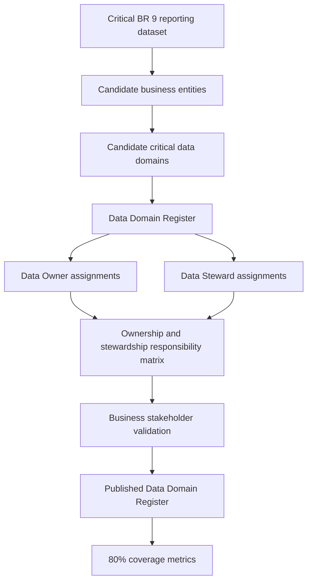

# Product Breakdown Structure - Data Domains & Ownership

## Source

This Product Breakdown Structure is derived only from `Data Domains & Ownership.md`.

## 1. Product Objective

The final product is a governed **Data Domain Register and Ownership Package** for critical data domains within scope. It must identify and document critical business data domains, assign accountable Data Owners and operational Data Stewards, and provide enough governance evidence for business stakeholders, Data Governance, Data Intelligence, Risk, Compliance, and Audit to understand accountability.

Success is measured by:

- Critical data domains identified, documented, and validated.
- Data Owners assigned and approved for at least 80% of critical data domains.
- Data Stewards assigned and approved for at least 80% of critical data domains.
- Data Domain Register completed and published.
- Progress metrics demonstrating at least 80% coverage of critical data domains.

## 2. Product Breakdown Structure

```text
Data Domain Governance Product
├── 1. Domain Discovery Package
│   ├── 1.1 Critical Reporting Dataset Input
│   ├── 1.2 Candidate Business Entity List
│   ├── 1.3 Candidate Data Domain List
│   ├── 1.4 Domain Prioritization Notes
│   └── 1.5 Discovery Gap Log
├── 2. Data Domain Register
│   ├── 2.1 Domain Name
│   ├── 2.2 Domain Description
│   ├── 2.3 Business Criticality
│   ├── 2.4 Source / Evidence Reference
│   ├── 2.5 Data Owner
│   ├── 2.6 Data Steward
│   ├── 2.7 Approval Status
│   └── 2.8 Last Review Date
├── 3. Ownership Assignment Package
│   ├── 3.1 Data Owner Candidate List
│   ├── 3.2 Approved Data Owner Assignments
│   ├── 3.3 Owner Responsibility Definition
│   ├── 3.4 Owner Approval Record
│   └── 3.5 Owner Gap List
├── 4. Stewardship Assignment Package
│   ├── 4.1 Data Steward Candidate List
│   ├── 4.2 Approved Data Steward Assignments
│   ├── 4.3 Steward Responsibility Definition
│   ├── 4.4 Steward Approval Record
│   └── 4.5 Steward Gap List
├── 5. Governance Accountability Package
│   ├── 5.1 Ownership and Stewardship Responsibility Matrix
│   ├── 5.2 Escalation Path
│   ├── 5.3 Decision-Making Responsibilities
│   ├── 5.4 Business Stakeholder Approval Evidence
│   └── 5.5 Audit Review Evidence
├── 6. Validation Package
│   ├── 6.1 Subject-Matter Expert Review Notes
│   ├── 6.2 Domain Boundary Validation
│   ├── 6.3 Coverage Validation
│   ├── 6.4 Open Question Register
│   └── 6.5 Validation Status Summary
├── 7. Publication and Access Package
│   ├── 7.1 Published Register Location
│   ├── 7.2 Access Control Matrix
│   ├── 7.3 Document Owner
│   ├── 7.4 Maintenance Process
│   └── 7.5 Review Cadence
└── 8. Progress Metrics Package
    ├── 8.1 Critical Domain Coverage Percentage
    ├── 8.2 Data Owner Assignment Percentage
    ├── 8.3 Data Steward Assignment Percentage
    ├── 8.4 Open Gap Count
    └── 8.5 Approval Completion Percentage
```

## 3. Product Descriptions

| Product ID | Product | Description | Acceptance / Quality Criteria | Source Traceability |
| --- | --- | --- | --- | --- |
| 1.0 | Domain Discovery Package | Evidence and analysis used to identify critical business entities and candidate data domains. | Critical entities and candidate domains are documented and reviewed. | FR-001; Scope; Source Data |
| 1.1 | Critical Reporting Dataset Input | Input from the critical regulatory/operational reporting process, specifically the BR 9 file. | Dataset access is available or the access dependency remains explicitly open. | Data Requirements 8.1; Dependency 13 |
| 1.2 | Candidate Business Entity List | List of business entities identified from the critical reporting dataset. | Entities are documented and ready for stakeholder validation. | FR-001; Key Business Entities |
| 1.3 | Candidate Data Domain List | Initial list of critical data domains within scope. | Domains are documented, reviewed, and linked to source evidence. | Scope 3.1; FR-001 |
| 1.4 | Domain Prioritization Notes | Rationale for which domains are treated as critical. | Priority is based on business importance and reviewable evidence. | Target State 6.1 |
| 1.5 | Discovery Gap Log | Gaps in domain identification, evidence, access, or SME knowledge. | Each gap has owner, status, and next action. | Current-State Challenges; Open Questions |
| 2.0 | Data Domain Register | Central inventory of critical data domains, owners, and stewards. | Register is created, completed, published, and available to authorized stakeholders. | Target Data Products 8.2; FR-002; Acceptance Criteria |
| 2.1 | Domain Name | Standard name for each critical domain. | Naming is consistent and understandable by business stakeholders. | FR-002 |
| 2.2 | Domain Description | Business definition of each domain. | Description explains meaning and scope of the domain. | Governance Requirements 12.2 |
| 2.3 | Business Criticality | Criticality classification for each domain. | Criticality is documented and reviewed. | Target State 6.1; Governance Requirements 12.2 |
| 2.4 | Source / Evidence Reference | Reference to source dataset, process, or analysis supporting the domain. | Each domain links to identifiable evidence. | Source Data 8.1 |
| 2.5 | Data Owner | Accountable business owner for the domain. | Owner assigned and approved for at least 80% of critical domains. | FR-003; Acceptance Criteria |
| 2.6 | Data Steward | Operational steward responsible for definitions, metadata, and governance support. | Steward assigned and approved for at least 80% of critical domains. | FR-004; Acceptance Criteria |
| 2.7 | Approval Status | Status showing whether the domain and assignments are draft, reviewed, approved, or blocked. | Status is maintained and visible. | NFR Observability; Acceptance Criteria |
| 2.8 | Last Review Date | Date of most recent stakeholder or governance review. | Review date is populated for approved or reviewed domains. | Operational Readiness |
| 3.0 | Ownership Assignment Package | Products needed to identify, validate, approve, and track Data Owner assignments. | Data Owner assignments are approved for at least 80% of critical domains. | Business Goals; FR-003 |
| 3.1 | Data Owner Candidate List | Candidate owner names or teams for each domain. | Candidate owner exists or owner gap is documented. | Scope 3.1; Current-State Challenges |
| 3.2 | Approved Data Owner Assignments | Final approved owner mapping. | Approved owner assignment is documented for each covered critical domain. | FR-003 |
| 3.3 | Owner Responsibility Definition | Description of owner accountability for business meaning, usage, quality, and prioritization. | Responsibilities are documented and approved. | Stakeholders; FR-005 |
| 3.4 | Owner Approval Record | Evidence that owner assignment was approved by business stakeholders. | Approval workflow evidence is retained. | Governance Requirements 12.2 |
| 3.5 | Owner Gap List | List of critical domains without an approved Data Owner. | Gaps are visible and actionable. | Risks and Mitigations |
| 4.0 | Stewardship Assignment Package | Products needed to identify, validate, approve, and track Data Steward assignments. | Data Steward assignments are approved for at least 80% of critical domains. | Business Goals; FR-004 |
| 4.1 | Data Steward Candidate List | Candidate steward names or teams for each domain. | Candidate steward exists or steward gap is documented. | Scope 3.1 |
| 4.2 | Approved Data Steward Assignments | Final approved steward mapping. | Approved steward assignment is documented for each covered critical domain. | FR-004 |
| 4.3 | Steward Responsibility Definition | Description of steward responsibility for definitions, metadata, and governance activity support. | Responsibilities are documented and approved. | Stakeholders; FR-005 |
| 4.4 | Steward Approval Record | Evidence that steward assignment was approved. | Approval evidence is retained. | Governance Requirements 12.2 |
| 4.5 | Steward Gap List | List of critical domains without an approved Data Steward. | Gaps are visible and actionable. | Risks and Mitigations |
| 5.0 | Governance Accountability Package | Operating artifacts that make domain ownership and stewardship usable for governance. | Ownership, stewardship, decision responsibilities, and escalation paths are documented. | Business Goals; FR-005 |
| 5.1 | Responsibility Matrix | Matrix showing data owners, stewards, focal point, technical lead, and governance responsibilities. | Responsibilities are approved and documented. | Users and Stakeholders; FR-005 |
| 5.2 | Escalation Path | Path for unresolved ownership, stewardship, or domain-boundary issues. | Escalation path is documented and available for use. | Business Goals; Risks |
| 5.3 | Decision-Making Responsibilities | Clarifies who approves domain definitions, owners, stewards, and changes. | Decision responsibility is documented. | Business Goals; Governance Requirements |
| 5.4 | Business Stakeholder Approval Evidence | Evidence of business review and acceptance. | Stakeholder approval is documented for completed domains. | Scope; Dependencies |
| 5.5 | Audit Review Evidence | Evidence that accountability assignments are available for review. | Ownership and stewardship information is auditable. | NFR Compliance; Governance Requirements |
| 6.0 | Validation Package | Products proving that domains, owners, and stewards were reviewed with SMEs and stakeholders. | Validation status is visible and unresolved gaps remain tracked. | Scope; Dependencies |
| 6.1 | SME Review Notes | Notes from subject-matter expert and data engineer reviews. | Review outputs are captured and linked to domain records. | Dependencies; Risks |
| 6.2 | Domain Boundary Validation | Confirmation that domain boundaries are agreed or gaps are documented. | Boundary disagreements are resolved or tracked. | Risks and Mitigations |
| 6.3 | Coverage Validation | Validation of progress toward 80% domain owner/steward coverage. | Coverage calculation is reproducible. | Acceptance Criteria |
| 6.4 | Open Question Register | Open questions with owner, due date, and status. | Questions are actively maintained. | Open Questions |
| 6.5 | Validation Status Summary | Summary of validated, pending, blocked, and approved domains. | Summary is current and available to stakeholders. | NFR Observability |
| 7.0 | Publication and Access Package | Products needed to publish and control access to the Data Domain Register. | Domain documentation is centralized, accessible, controlled, and maintainable. | Non-Functional Requirements; Access Control |
| 7.1 | Published Register Location | Final location of the Data Domain Register. | Published location is documented. | NFR Performance / Availability |
| 7.2 | Access Control Matrix | Defines read/write/admin access for Data Governance, Data Owners, Data Stewards, and business stakeholders. | Access matches governance requirements. | Security 12.1 |
| 7.3 | Document Owner | Accountable maintainer of the register. | Owner is assigned. | NFR Maintainability |
| 7.4 | Maintenance Process | Process for updating domains, owners, stewards, and statuses. | Updates are repeatable and controlled. | NFR Scalability |
| 7.5 | Review Cadence | Frequency for reviewing and approving updates. | Review cadence supports governance and audit needs. | NFR Compliance / Observability |
| 8.0 | Progress Metrics Package | Metrics showing whether the epic is meeting its coverage and approval goals. | Metrics demonstrate at least 80% critical-domain coverage. | Acceptance Criteria |
| 8.1 | Critical Domain Coverage Percentage | Percentage of critical domains identified and documented. | Coverage metric is calculated and reported. | Acceptance Criteria |
| 8.2 | Data Owner Assignment Percentage | Percentage of critical domains with approved Data Owners. | At least 80% coverage. | Business Goals; Acceptance Criteria |
| 8.3 | Data Steward Assignment Percentage | Percentage of critical domains with approved Data Stewards. | At least 80% coverage. | Business Goals; Acceptance Criteria |
| 8.4 | Open Gap Count | Count of open owner, steward, domain, access, or validation gaps. | Open gaps are visible for follow-up. | Current-State Challenges; Risks |
| 8.5 | Approval Completion Percentage | Percentage of domain records with approval completed. | Approval progress is measurable. | Governance Requirements; Acceptance Criteria |

## 4. Product Flow



## 5. Product Acceptance Summary

| Acceptance Area | Product(s) That Prove It |
| --- | --- |
| Critical domains identified, documented, and validated | Domain Discovery Package; Data Domain Register; Validation Package |
| Data Owners assigned and approved for at least 80% of critical domains | Ownership Assignment Package; Progress Metrics Package |
| Data Stewards assigned and approved for at least 80% of critical domains | Stewardship Assignment Package; Progress Metrics Package |
| Data Domain Register completed and published | Data Domain Register; Publication and Access Package |
| Progress metrics demonstrate at least 80% coverage | Progress Metrics Package |

## 6. Required Items Still Missing From the Source Epic

The source epic is sufficient to create this PBS. The following items are still required to complete the final product:

| Missing Item | Needed For |
| --- | --- |
| Actual list of critical domains | Data Domain Register |
| Actual list of business entities | Domain Discovery Package |
| Confirmed source fields from BR 9 | Source / evidence reference for each domain |
| Candidate Data Owners | Ownership Assignment Package |
| Approved Data Owners | 80% owner coverage acceptance |
| Candidate Data Stewards | Stewardship Assignment Package |
| Approved Data Stewards | 80% steward coverage acceptance |
| Domain boundary decisions | Domain validation and stakeholder approval |
| Approval dates and approvers | Governance accountability and auditability |
| Published register location | Publication and access package |
| Review cadence and maintenance owner | Operational readiness |

## 7. Product Quality Criteria

| Quality Area | Criteria |
| --- | --- |
| Completeness | Register includes domain, description, criticality, owner, steward, approval status, and review status. |
| Validation | Domain definitions and owner/steward assignments are reviewed by business stakeholders or SMEs. |
| Accountability | Each critical domain has an assigned Data Owner and Data Steward or an explicit gap. |
| Accessibility | Authorized stakeholders can access the published register. |
| Security | Access follows the defined Data Governance Team, Data Owner, Data Steward, and Business Stakeholder model. |
| Auditability | Ownership and stewardship assignments are documented and available for review. |
| Observability | Coverage metrics are available and show progress toward the 80% target. |
| Scalability | Structure can be reused for additional enterprise data domains in future phases. |
